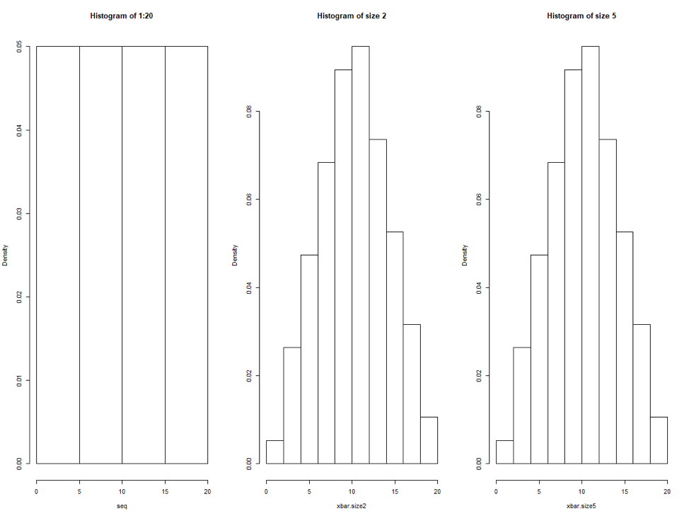
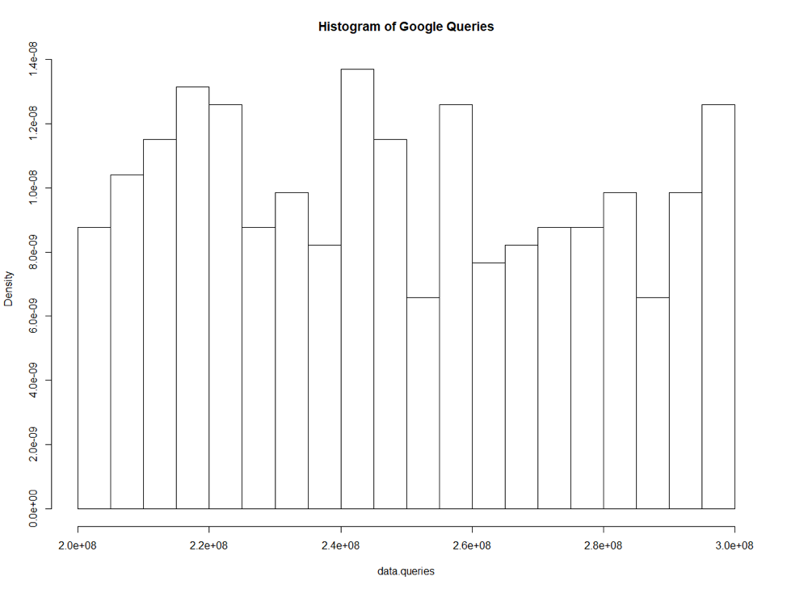
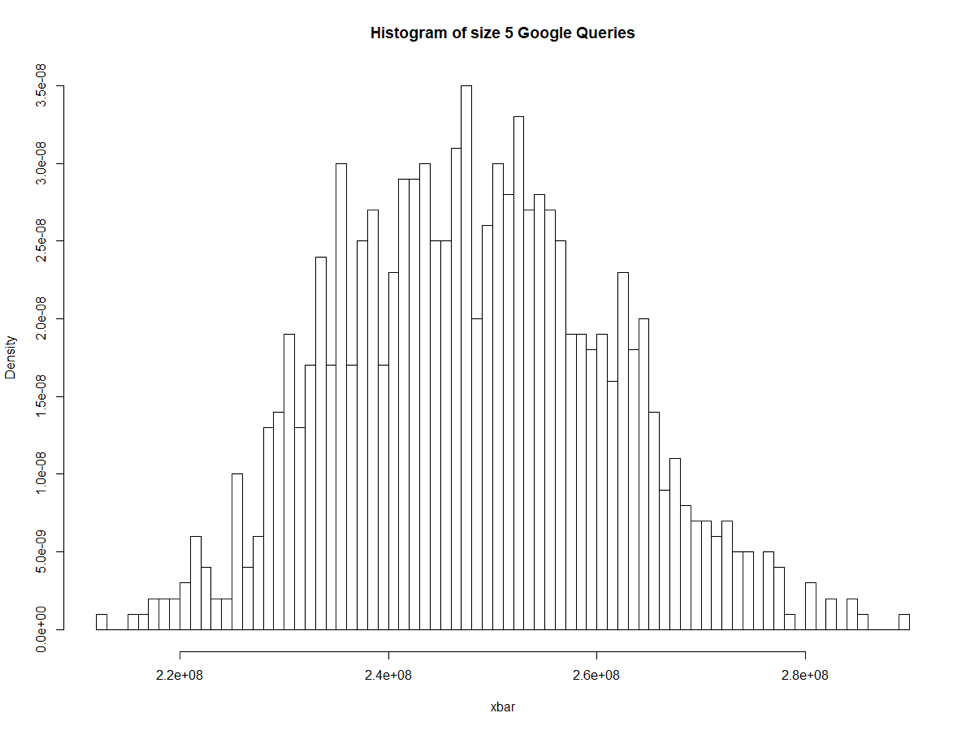
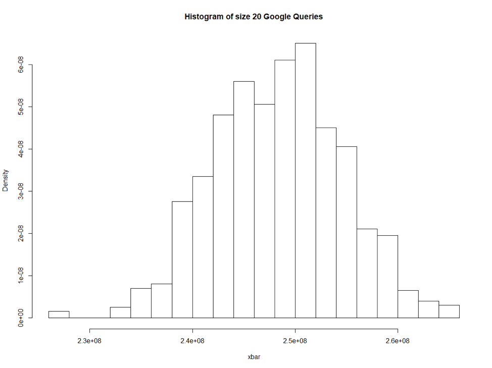
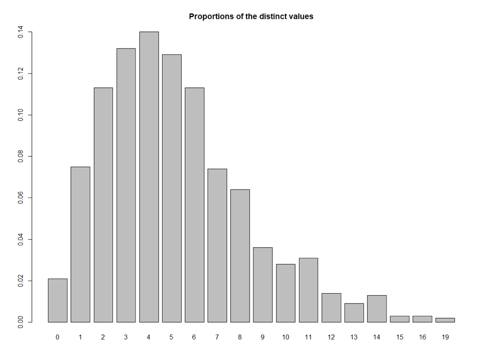
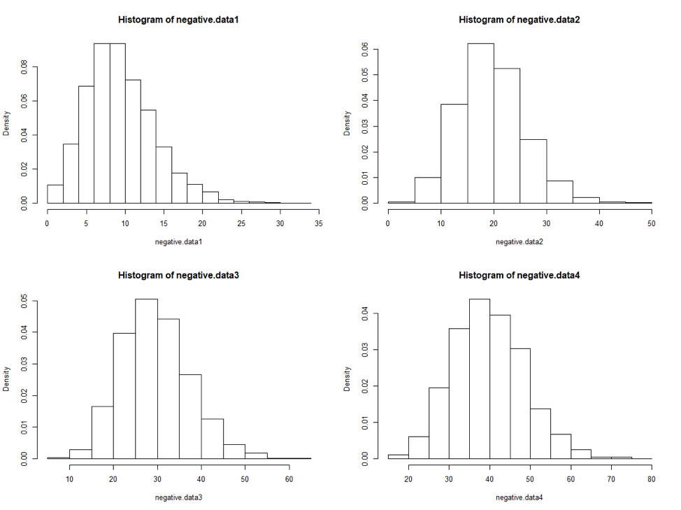
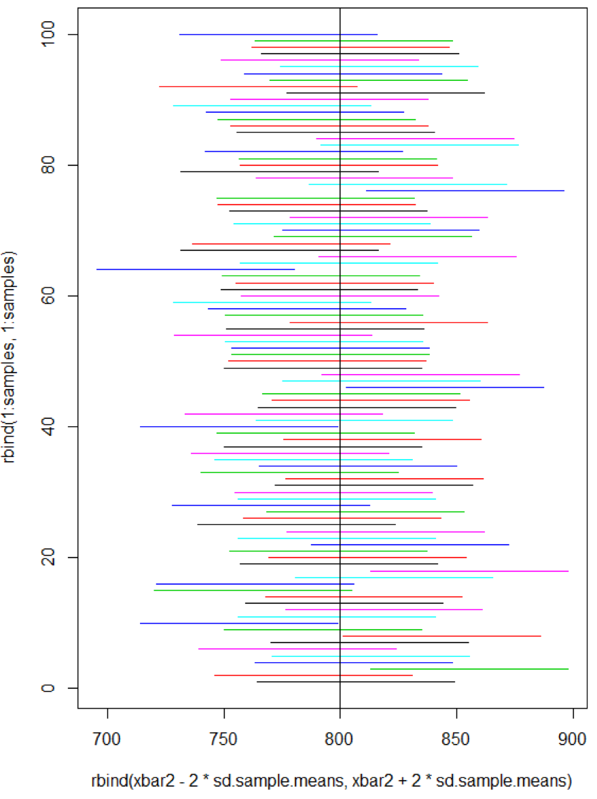

## R Data Analysis examples


### Barplot

### Using library library(UsingR)

Use the primes (UsingR) dataset. Use the diff function to compute the
differences between successive primes. Show the frequencies of these
differences. Show the barplot of these differences.
```R
library(UsingR)

diff.primes<-diff(primes)
table(diff.primes)
barplot(table(diff.primes),
ylim=c(0, 100),col="green", xlab="Successive primes difference")
```


barplot for the number of coins by year.
```R
attach(coins)
coins # check the shape of coins 
coins.table <- table(year,value)
# Show the barplot for the number of coins by year.
barplot(apply(coins.table,1,sum),ylim=c(0,50), col="blue", xlab="Year", ylab="Number of coins by year")
```


Show the horizontal boxplot of the data along with the appropriate labels
on the plot.
```R

stem(south)
boxplot(south, horizontal=TRUE, xaxt="n", col="blue")
axis(side=1, at=five.num, labels=TRUE)
text(five.num, rep(1.2,5), srt=90, adj=0, labels=c("Min","Lower Hinge","Median","Upper Hinge","Max")) 
```


Show the histogram of the data.
```R
pi.frequency <-table(pi2000)
pi.frequency

# Show the percentages of their frequencies.
pi.freq.perc <- (pi.frequency/length(pi2000))*100
pi.freq.perc

hist(pi2000, col="green")
```


Using appropriate colors, show the mosaic plot for the data. Also show
the barplot for Gender and Sport separately with the bars side by side. Add
legend to the plots.

```R
# Using cbind, create the matrix for the above data.
matrix<-cbind(c(25,20), c(10,40), c(15,30))
matrix

#Set the row names for the data.
gender <- c("Men","Women")
sport <- c("NFL","NBA","NHL")

rownames(matrix)<- gender
matrix
# Set the column names for the data.
colnames(matrix) <- sport
matrix

# add the dimension variables Gender and Sport to the data.
dimnames(matrix) <- list(Gender=gender, Sport=sport)
matrix
```
Mosaicplot
```R
mosaicplot(matrix, main = "Sport vs Gender", color=c("green", "blue", "cyan")) # [3]

```

Barplot 
```R
barplot(matrix, beside=TRUE, legend.text=TRUE, col=c("blue","pink"), main= "Gender and Sport")
```


Calculate and plot the PMF for the first 20 cars.
```R
c <-0:20
pmf.first.cars <-dpois(c, lambda = 10)
pmf.first.cars
plot(c, pmf.first.cars,type="h", main="Probability Mass Function Plot first 20 cars")
points(c, pmf.first.cars, pch=20)
```

 Show the PDF plot of this distribution covering the three standard
```R
dist <- seq(60, 140)
pdf <- dnorm(dist, mean=100, sd=10)
plot(dist, pdf, main="Probability Distribution covering the three standard Deviations", xlab="x",ylab="Probability", type="l", xlim=c(60,140))
```


Show a plot for 10,000 visitors using the above distribution.
```R
visitors <- rnorm(10000, mean=100, sd=10)
#visitors 
visitors.round <- round(visitors)
visitors.round.table <- table(visitors.round)
visitors.round.table
plot(visitors.round.table, type="h")
```

the CDF of this distribution.
```R
rate <- 18
dist <- seq(0, 1, by=1/60)
cdf  <- pexp(dist, rate=rate)
plot(dist, cdf, type="l", main="Cumulative Distribution Function Calls", xlab="x")
```


the histogram of the densities of this distribution.
```R
par(mfrow=c(1, 3)) # plot the 3 histogram in one row                
seq <- seq(1, 20)
hist(seq, prob=TRUE,  main = "Histogram of 1:20") 
```


Show the histogram of the distribution of the number of queries. Compute the mean and
standard deviation of the number of queries Google has had per day.
```R
data.queries <- read.csv("queries.csv") 
data.queries <- as.numeric(unlist(data.queries))  # c
data.queries
sample.mean <- mean(data.queries)
sample.sd <- sd(data.queries)
par(mfrow=c(1, 1)) # need 1 layout
hist(data.queries, prob=TRUE, main = "Histogram of Google Queries", breaks = 20) 
```

Draw 1000 samples of this data of size 5, show the histogram of the densities of the sample
means. Compute the mean of the sample means and the standard deviation of the sample means.
```R
samples <- 1000
sample.size <- 5

xbar <- numeric(samples)

for (i in 1:samples) {
  xbar[i] <- mean(sample(data.queries, sample.size)) # 
}
#xbar
par(mfrow=c(1, 1)) # need 1 layout
hist(xbar, prob = TRUE, main = "Histogram of size 5 Google Queries",  breaks = 100)
sample.mean5<-mean(xbar)
sample.mean5
sample.sd5<-sd(xbar)
sample.sd5
```


Draw 1000 samples of this data of size 20, show the histogram of the densities of the sample
means. Compute the mean of the sample means and the standard deviation of the sample means.
```R
sample.size <-20
xbar <- numeric(samples)
for (i in 1:samples) {
  xbar[i] <- mean(sample(data.queries, sample.size)) # 
}
#xbar
par(mfrow=c(1, 1)) # need 1 layout
hist(xbar, prob = TRUE, main = "Histogram of size 20 Google Queries", breaks = 25)
sample.mean20<-mean(xbar)
sample.mean20
sample.sd20<-sd(xbar)
sample.sd20
```

Generate 1000 random numbers from this distribution. Show the barplot
with the proportions of the distinct values of this distribution.
```R
size <- 5
prob <- 0.5
randnumber <- 1000
data.negative <- rnbinom(randnumber, size=size, prob=prob) #6
data.proportions <- prop.table(table(data.negative))
barplot(data.proportions, main="Proportions of the distinct values")
```

With samples sizes of 10, 20, 30, and 40, generate the data for 5000
samples using the same distribution. Show the histograms of the densities
of the sample means. Use a 2 x 2 layout.
```R
par(mfrow = c(2, 2)) # layout 2x2

randnumber <- 5000

negative.data1 <- rnbinom(randnumber, size=10, prob=.5)
negative.data2 <- rnbinom(randnumber, size=20, prob=.5)
negative.data3 <- rnbinom(randnumber, size=30, prob=.5)
negative.data4 <- rnbinom(randnumber, size=40, prob=.5)

hist(negative.data1, prob=TRUE)
hist(negative.data2, prob=TRUE)
hist(negative.data3, prob=TRUE)
hist(negative.data4, prob=TRUE)
```

raw 100 samples from the above data. Plot the confidence intervals for
these 100 samples. Determine how many samples do not have the
population mean within their 95.44% confidence intervals?
```R
samples <- 100
xbar2 <- numeric(samples)
for (i in 1: samples) {
  sample.data.1 <- sample(x, size=sample.size)
  xbar2[i] <- mean(sample.data.1)
  str <- sprintf("%2d: xbar = %.2f, CI = %.2f - %.2f",
                 i, xbar2[i], xbar2[i] - 2*sd.sample.means,
                 xbar2[i] + 2*sd.sample.means)
  cat(str,"\n")
}
xbar2
# number outside the range
sum(abs(xbar2-pop.mean) > 2*sd.sample.means)
matplot(rbind(xbar2 - 2*sd.sample.means, xbar2 + 2*sd.sample.means),
        rbind(1:samples, 1:samples), type="l", lty=1)
abline(v = pop.mean)
```
