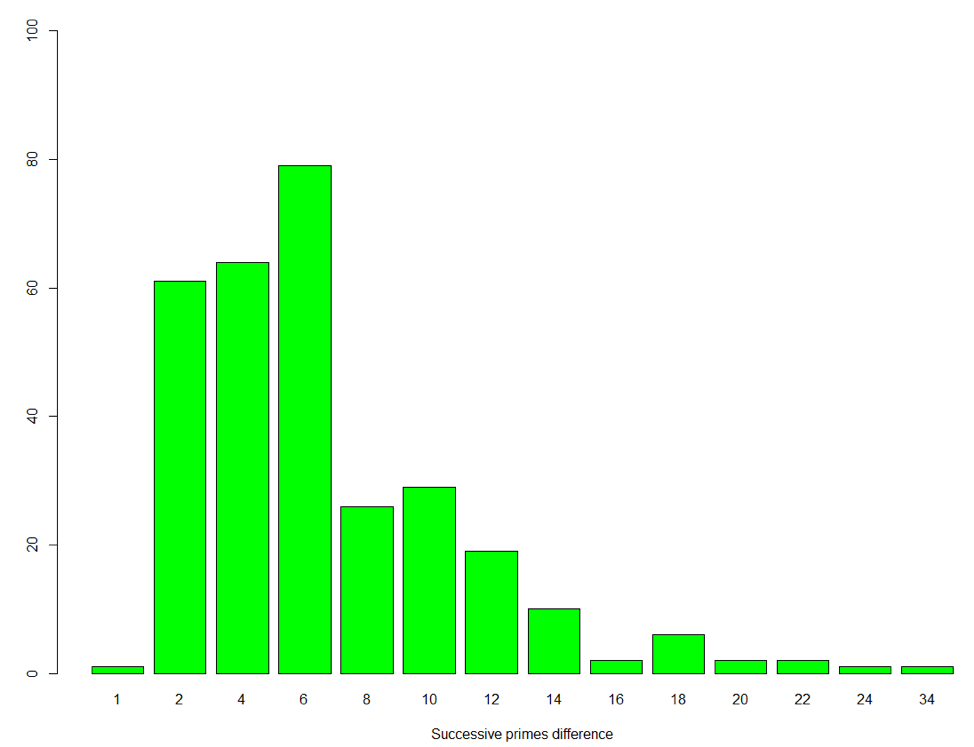
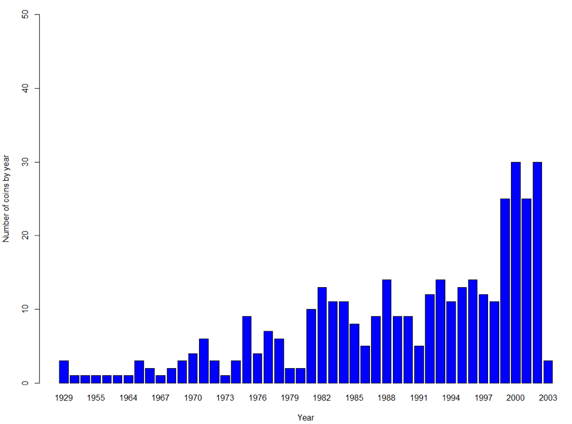
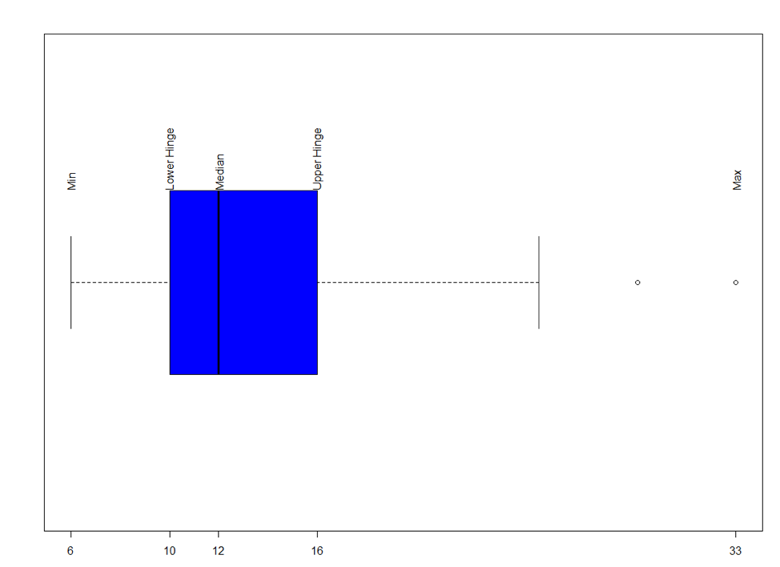
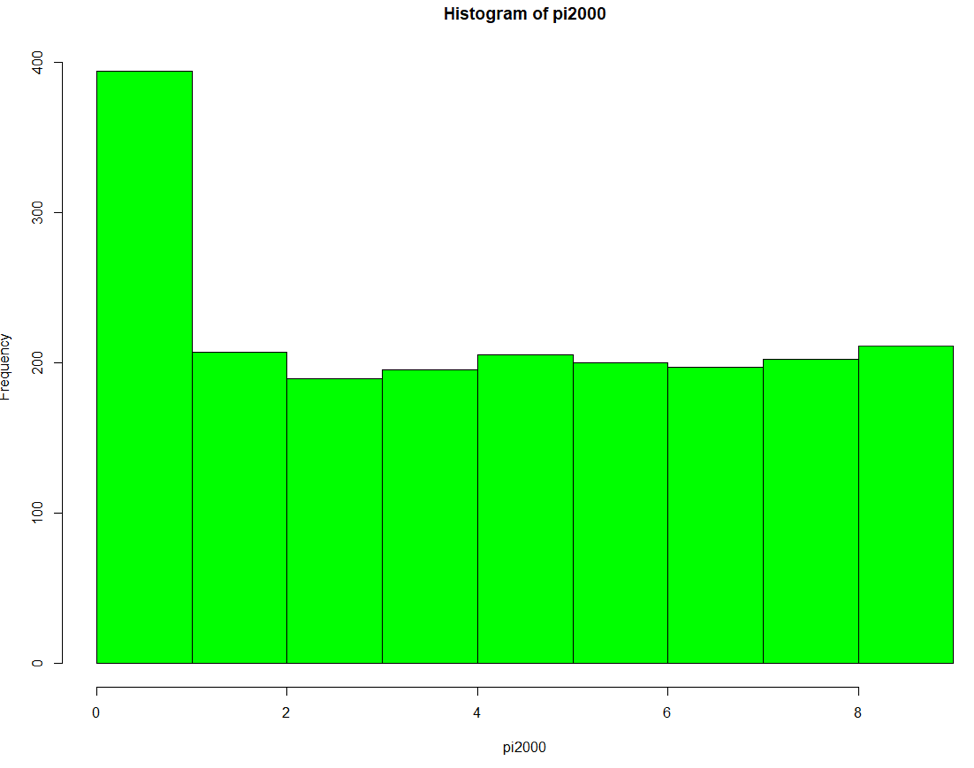
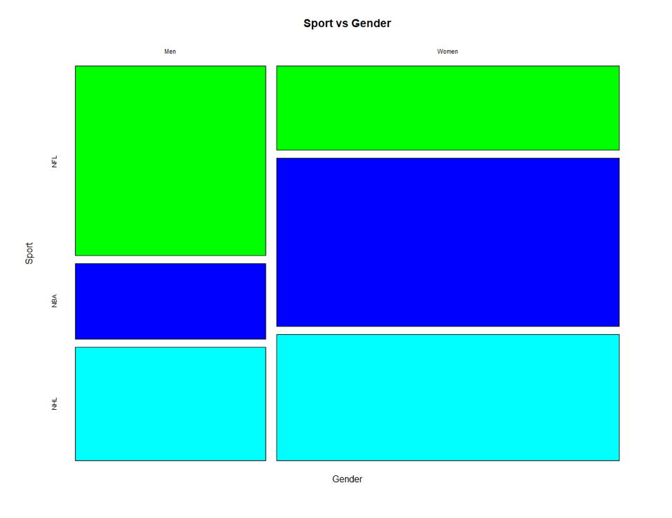
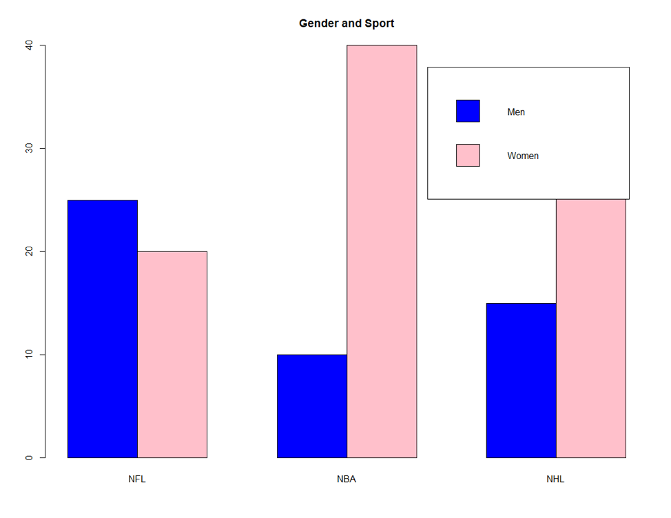
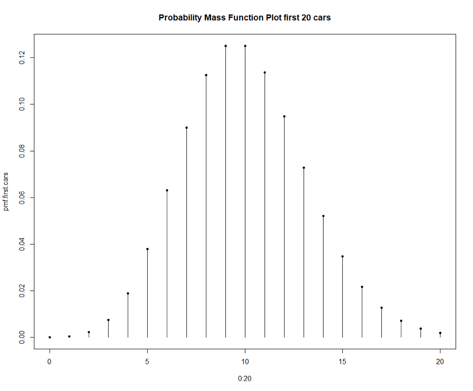
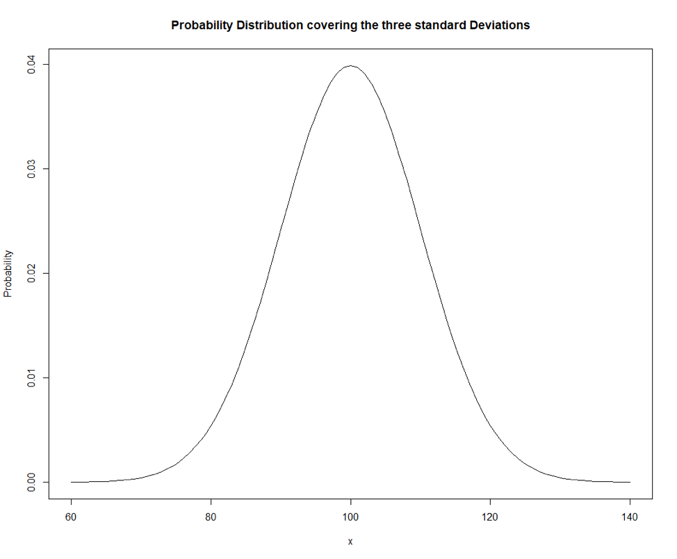
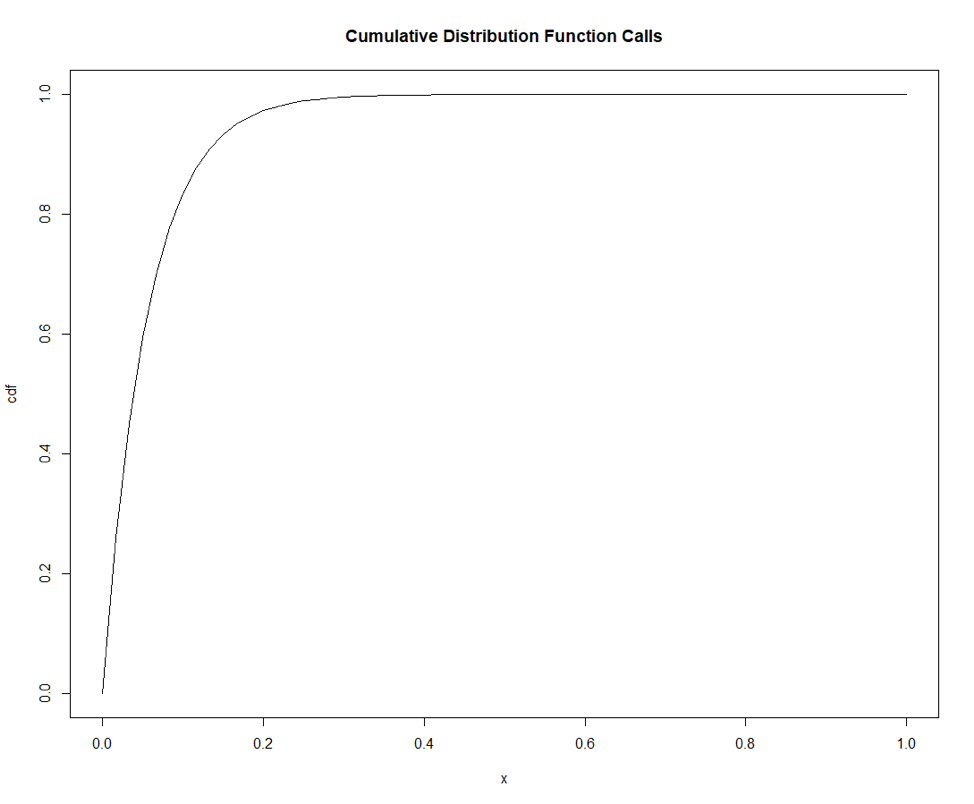

## R Data Analysis examples


### Barplot

### Using library library(UsingR)

Use the primes (UsingR) dataset. Use the diff function to compute the
differences between successive primes. Show the frequencies of these
differences. Show the barplot of these differences.
```R
library(UsingR)

diff.primes<-diff(primes)
table(diff.primes)
barplot(table(diff.primes),
ylim=c(0, 100),col="green", xlab="Successive primes difference")
```



barplot for the number of coins by year.
```R
attach(coins)
coins # check the shape of coins 
coins.table <- table(year,value)
# Show the barplot for the number of coins by year.
barplot(apply(coins.table,1,sum),ylim=c(0,50), col="blue", xlab="Year", ylab="Number of coins by year")
```


Show the horizontal boxplot of the data along with the appropriate labels
on the plot.
```R

stem(south)
boxplot(south, horizontal=TRUE, xaxt="n", col="blue")
axis(side=1, at=five.num, labels=TRUE)
text(five.num, rep(1.2,5), srt=90, adj=0, labels=c("Min","Lower Hinge","Median","Upper Hinge","Max")) 
```


Show the histogram of the data.
```R
pi.frequency <-table(pi2000)
pi.frequency

# Show the percentages of their frequencies.
pi.freq.perc <- (pi.frequency/length(pi2000))*100
pi.freq.perc

hist(pi2000, col="green")
```



Using appropriate colors, show the mosaic plot for the data. Also show
the barplot for Gender and Sport separately with the bars side by side. Add
legend to the plots.
```R
# Using cbind, create the matrix for the above data.
matrix<-cbind(c(25,20), c(10,40), c(15,30))
matrix

#Set the row names for the data.
gender <- c("Men","Women")
sport <- c("NFL","NBA","NHL")

rownames(matrix)<- gender
matrix
# Set the column names for the data.
colnames(matrix) <- sport
matrix

# add the dimension variables Gender and Sport to the data.
dimnames(matrix) <- list(Gender=gender, Sport=sport)
matrix
mosaicplot(matrix, main = "Sport vs Gender", color=c("green", "blue", "cyan")) # [3]

```


```R
barplot(matrix, beside=TRUE, legend.text=TRUE, col=c("blue","pink"), main= "Gender and Sport")
```


```R
# d) Calculate and plot the PMF for the first 20 cars.
c <-0:20
pmf.first.cars <-dpois(c, lambda = 10)
pmf.first.cars
plot(c, pmf.first.cars,type="h", main="Probability Mass Function Plot first 20 cars")
points(c, pmf.first.cars, pch=20)
```




```R
dist <- seq(60, 140)
pdf <- dnorm(dist, mean=100, sd=10)
plot(dist, pdf, main="Probability Distribution covering the three standard Deviations", xlab="x",ylab="Probability", type="l", xlim=c(60,140))
```



```R
visitors <- rnorm(10000, mean=100, sd=10)
#visitors 
visitors.round <- round(visitors)
visitors.round.table <- table(visitors.round)
visitors.round.table
plot(visitors.round.table, type="h")
```


```R
rate <- 18
dist <- seq(0, 1, by=1/60)
cdf  <- pexp(dist, rate=rate)
plot(dist, cdf, type="l", main="Cumulative Distribution Function Calls", xlab="x")
```



