## DATA MINING: NASA KEPLER EXOPLONETS with R


- Exoplanets dataset selected from Kaggle.com
- Almost 10K Objects have been analyzed by NASA’s Kepler mission.
- Exoplanets are planets beyond our solar system that orbit a star. 
- The spacecraft looks at stars waiting for object to cross their path. 
- These objects causes a bend in the light captured by the telescope and astrophysicist classified them as exoplanets or other stellar entities.


The Kepler exoplanets dataset is a cumulative data observed by Kepler Space Telescope. 
The Kepler Object of Interest (KOI) has extended data info, the most relevant for this presentations are:

Koi_disposition: the archived placement of an exoplanet candidate (CANDIDATE, FALSE POSITIVE,CONFIRMED)

Koi_pdisposition: updated placement of an exoplanet candidate (FALSE POSITIVE, CANDIDATE)

Koi_score: indicate the confidence in the KOI placement. close to 0 False Positive 

Koi_duration: The duration of the observed transits (hours)

Koi period: The interval between consecutive planetary transits (days)

Table presentation by Google Visualization Library
```R
library(googleVis)
exo.data<- read.csv("kepler-exoplanets.csv") #load the data

#KOI = Kepler object of interes
exo.subset <-subset(exo.data, 
                    select=c(kepler_name,koi_disposition,
                             koi_pdisposition,koi_score,
                             koi_period,koi_duration))
exo.subset$has_score <- !is.na(exo.subset$koi_score) # add new variable true or false if the KOI has score assigned
summary(exo.subset)
exo.table <- gvisTable(head(exo.subset, 30)) #30 as a snapshot of the dataset
plot(exo.table)
```
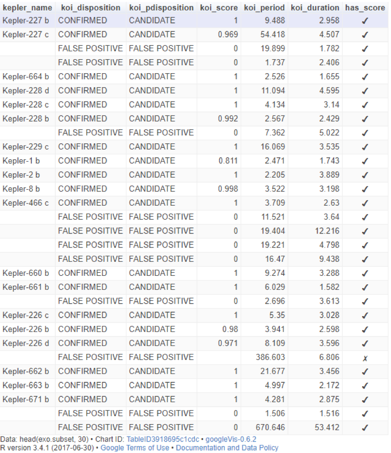

Barplot fo the categorical variable pdisposition 
```R
exo.categorical.table <-  table(exo.subset$koi_pdisposition)
exo.categorical.table
barplot(exo.categorical.table,  main="Exoplanets", 
        ylab="Counts", xlab="pdisposition", col=c("darkblue","red"))
```
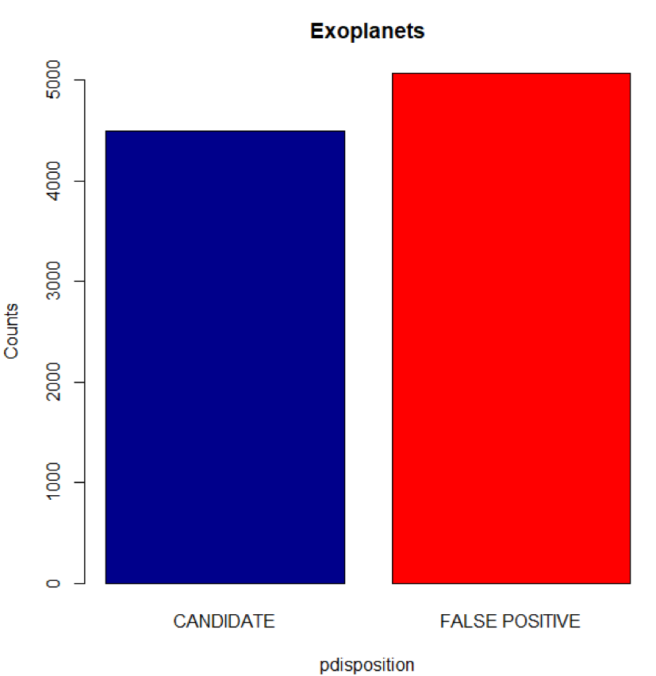

Pie chart for the percentage of objects that has score 
```R
koi_score.data <- table(exo.subset$has_score)
slice.labels <- names(koi_score.data)
slice.percents <- round(koi_score.data/sum(koi_score.data)*100)
slice.labels <- paste(slice.labels, slice.percents)
slice.labels <- paste(slice.labels, "%", sep="")

pie(koi_score.data, main="% has koi_score", labels = slice.labels, 
    col=c("red","darkblue"))
```
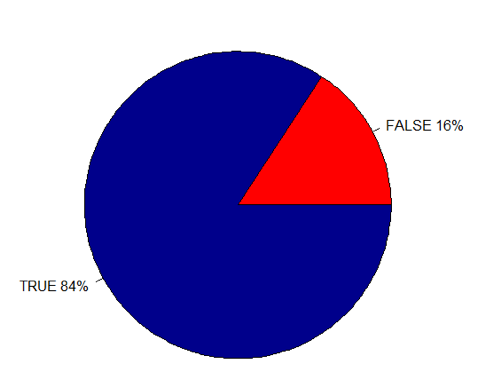

Two ways barplot for exoplanets that has score
```R
exo.categorical.table.multi <-  table(exo.subset$has_score,exo.subset$koi_pdisposition)
exo.categorical.table.multi
barplot(exo.categorical.table.multi,  main="Exoplanets with Score", legend.text = TRUE,
        ylab="Counts", xlab="pdisposition", col=c("red","darkblue"))
```
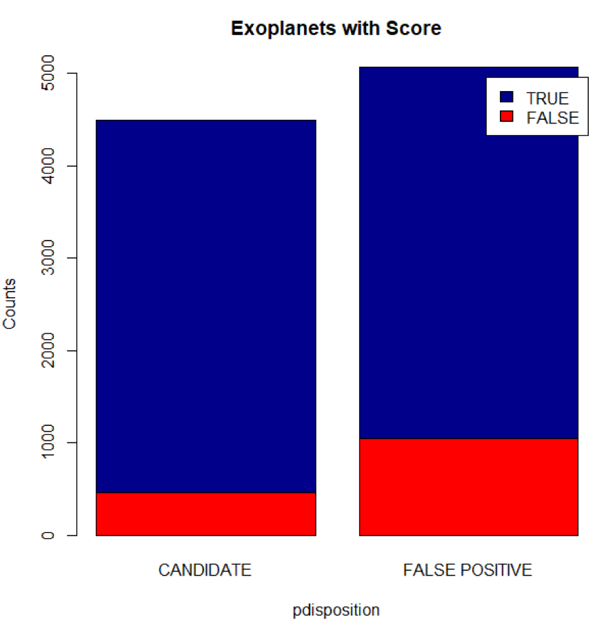


Selecte koi_duration  for pdisposition candidates, in other words, I did a subset of my subset with only confirmed exoplanets.<br/>
Use ggplot to display the data distribution and the density line
```R
library(ggplot2)
exo.candidates <-subset(exo.subset, koi_pdisposition == "CANDIDATE") # subset of candidates KOI
summary(exo.candidates)
fivenum(exo.candidates$koi_duration)
ggplot(data=exo.candidates, aes(exo.candidates$koi_duration)) + 
  geom_histogram(aes(y =..density..), 
                 col="red", 
                 fill="lightgreen", 
                 alpha=.2) + 
  geom_density(col=2) + 

  scale_x_continuous(limits = c(0.0, 30)) +
  labs(title="Histogram koi_duration", x="duration in hours", y="Count")
```
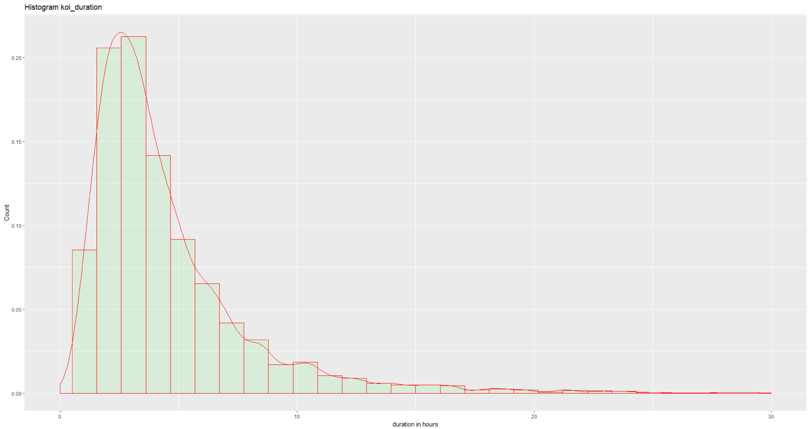

Central Limit Theorem for this variable.<br/>
Selecte koi_duration from the exoplanets confirmed subset dataset 
create different samples 10,20,30,40
```R
par(mfrow = c(2, 2)) # layout 2x2
samples <-1000
sample.size <- 10
xbar <- numeric(samples)
for (i in 1:samples) {
  xbar[i] <- mean(sample(exo.candidates$koi_duration, sample.size)) # what I did here is create a sample size 5 for each element of the 1000 entry []5
}
hist(xbar, prob = TRUE,   border="red", col="lightgreen",  
     main="Histogram of size 10 koi_duration", xlab="duration in hours")
lines(density(xbar), col="red", lwd=2) # add a density estimate with defaults
lines(density(xbar, adjust=2), lty="dotted", col="darkgreen", lwd=2) 


sample.mean10<-mean(xbar)
sample.mean10
sample.sd10<-sd(xbar)
sample.sd10

sample.size <- 20
xbar <- numeric(samples)

for (i in 1:samples) {
  xbar[i] <- mean(sample(exo.candidates$koi_duration, sample.size)) # what I did here is create a sample size 5 for each element of the 1000 entry []5
}
#xbar

hist(xbar, prob = TRUE,   border="red", col="lightgreen",  
     main="Histogram of size 20 koi_duration", xlab="duration in hours")

lines(density(xbar), col="red", lwd=2) # add a density estimate with defaults
lines(density(xbar, adjust=2), lty="dotted", col="darkgreen", lwd=2) 

sample.mean20<-mean(xbar)
sample.mean20
sample.sd20<-sd(xbar)
sample.sd20

sample.size <- 30

xbar <- numeric(samples)

for (i in 1:samples) {
  xbar[i] <- mean(sample(exo.candidates$koi_duration, sample.size)) 
}
#xbar

hist(xbar, prob = TRUE,   border="red", col="lightgreen",  
     main="Histogram of size 30 koi_duration", xlab="duration in hours")

lines(density(xbar), col="red", lwd=2) # add a density estimate with defaults
lines(density(xbar, adjust=2), lty="dotted", col="darkgreen", lwd=2) 


sample.mean30<-mean(xbar)
sample.mean30
sample.sd30<-sd(xbar)
sample.sd30

sample.size <- 40

xbar <- numeric(samples)

for (i in 1:samples) {
  xbar[i] <- mean(sample(exo.candidates$koi_duration, sample.size)) 
}
#xbar
hist(xbar, prob = TRUE,   border="red", col="lightgreen",  #xlim=c(1,6),
     main="Histogram of size 40 koi_duration", xlab="duration in hours")

lines(density(xbar), col="red", lwd=2) # add a density estimate with defaults
lines(density(xbar, adjust=2), lty="dotted", col="darkgreen", lwd=2) 
```
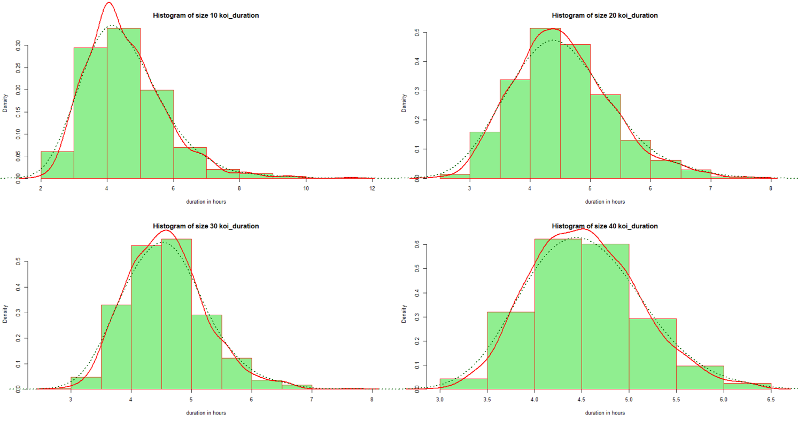

## Data Sampling

Random Sampling
```R
par(mfrow = c(1, 1)) # layout 1x1
library(prob)
library(sampling)
#random sampling
set.seed(123)
n <- 20
N <- nrow(exo.candidates)
randset <- srswor(n, N)
dataset <-exo.candidates[randset  != 0,] 
#dataset
reg.table <-table(exo.candidates$koi_duration)
reg.proportions <-prop.table(reg.table)   
# reg.table
# reg.proportions
summary(dataset$koi_duration)
hist(dataset$koi_duration, prob = TRUE,   border="red", col="lightgreen",
     main="Random sampling koi_duration", xlab="duration in hours")
lines(density(dataset$koi_duration), col="red", lwd=2) 
```
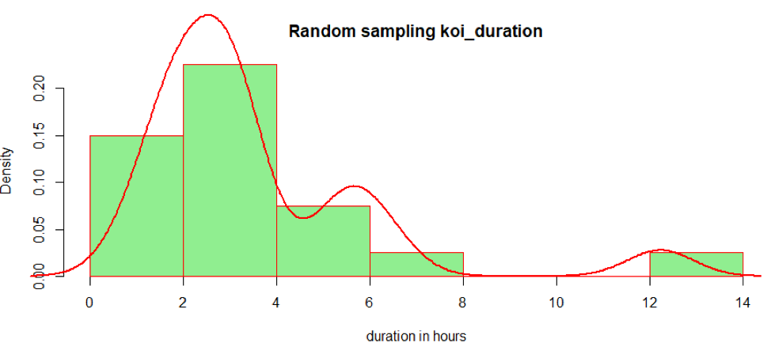

Systematic Sampling

```R
set.seed(113)
k <- ceiling(N / n) # from a)
k
r <- sample(k, 1)
r
# select every kth item
s <- seq(r, by = k, length = n)

sample.3 <- exo.candidates[s,]
reg.table <-table(sample.3$koi_period)
reg.proportions <-prop.table(reg.table)

summary(sample.3$koi_duration)
hist(sample.3$koi_duration, prob = TRUE,   border="red", col="lightgreen",  
     main="Systematic sampling koi_duration", xlab="duration in hours")
lines(density(sample.3$koi_duration), col="red", lwd=2) 
```
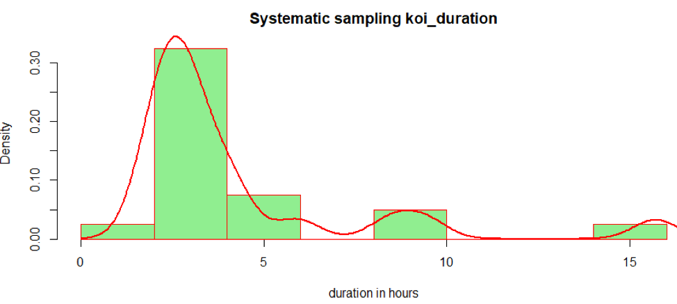

Inclusion Probability Sampling

```R
set.seed(133)
pik <- inclusionprobabilities(exo.candidates$koi_duration, n)
length(pik)
sum(pik)

s <- UPsystematic(pik)
sample.4 <-  exo.candidates[s != 0, ]
table(sample.4$koi_period)
reg.table <-table(sample.4$koi_duration)
reg.proportions <-prop.table(reg.table)
reg.proportions
summary(sample.4$koi_duration)
hist(sample.4$koi_duration, prob = TRUE,   border="red", col="lightgreen",  
     main="Inclusion Probability sampling koi_duration", xlab="duration in hours")
lines(density(sample.4$koi_duration), col="red", lwd=2) 
```
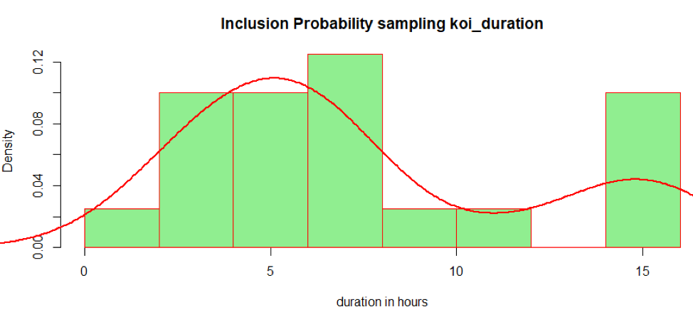

Stratified sampling

```R
sorted.exo <- exo.candidates[order(exo.candidates$koi_pdisposition),]
exo.frequency <- table(sorted.exo$koi_pdisposition)
exo.frequency

st.sizes <- 20 * exo.frequency / sum(exo.frequency)
st.sizes

st.sizes <- as.vector(st.sizes)
st.sizes <- st.sizes[st.sizes != 0]
st.sizes
sample.st <- strata(sorted.exo,  stratanames = c("koi_pdisposition"),
                    size = st.sizes, method = "srswor", description=TRUE)

mu.st.id_unit <-exo.candidates[sample.st$ID_unit,]

summary(mu.st.id_unit$koi_duration)
hist(mu.st.id_unit$koi_duration, prob = TRUE,   border="red", col="lightgreen",
     main="Stratified sampling koi_duration", xlab="duration in hours")
lines(density(mu.st.id_unit$koi_duration), col="red", lwd=2)
``` 
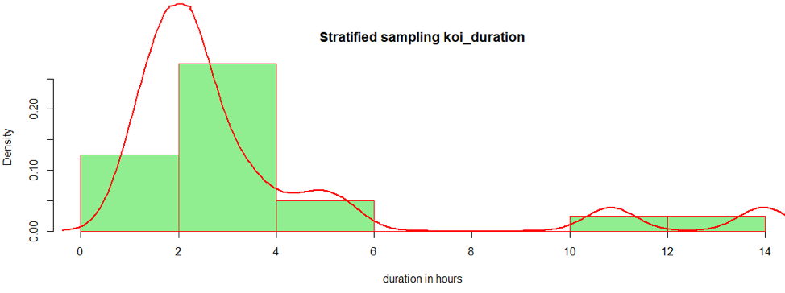

All Sampling together
```R
par(mfrow = c(2, 2)) # layout 
hist(dataset$koi_duration, prob = TRUE,   border="red", col="lightgreen",  
     main="Random sampling koi_duration", xlab="duration in hours")
lines(density(dataset$koi_duration), col="red", lwd=2) 
hist(sample.3$koi_duration, prob = TRUE,   border="red", col="lightgreen",  
     main="Systematic sampling koi_duration", xlab="duration in hours")
lines(density(sample.3$koi_duration), col="red", lwd=2) 
hist(sample.4$koi_duration, prob = TRUE,   border="red", col="lightgreen",  
     main="Inclusion Probability sampling koi_duration", xlab="duration in hours")
lines(density(sample.4$koi_duration), col="red", lwd=2) 
hist(mu.st.id_unit$koi_duration, prob = TRUE,   border="red", col="lightgreen",
     main="Stratified sampling koi_duration", xlab="duration in hours")
lines(density(mu.st.id_unit$koi_duration), col="red", lwd=2)
```
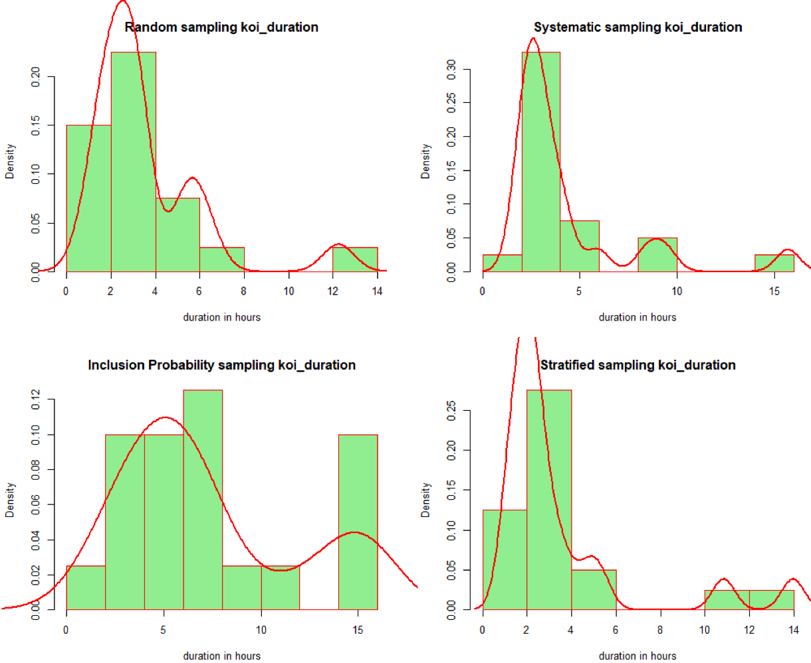


Confidence levels of 80%and 90 % of koi_duration
```R
set.seed(150)

pop.mean <- mean(exo.candidates$koi_duration)
pop.sd <- sd(exo.candidates$koi_duration)

x <- exo.candidates$koi_duration
sample.size <- 30

sd.sample.means <- pop.sd/sqrt(sample.size)
sd.sample.means

sample.data <- sample(x, size=sample.size)
sample.data

xbar <- mean(sample.data)
xbar

cat("95.44% Conf Interval = ",
    xbar - 2*sd.sample.means, "-", 
    xbar + 2*sd.sample.means, "\n")

samples <- 100

xbar2 <- numeric(samples)

for (i in 1: samples) {
  sample.data.1 <- sample(x, size=sample.size)
  xbar2[i] <- mean(sample.data.1)
  str <- sprintf("%2d: xbar = %.2f, CI = %.2f - %.2f",
                 i, xbar2[i], xbar2[i] - 2*sd.sample.means,
                 xbar2[i] + 2*sd.sample.means)
  cat(str,"\n")
}
xbar2
# number outside the range
sum(abs(xbar2-pop.mean) > 2*sd.sample.means)

matplot(rbind(xbar2 - 2*sd.sample.means, xbar2 + 2*sd.sample.means),
        rbind(1:samples, 1:samples), type="l", lty=1)
abline(v = pop.mean)
```
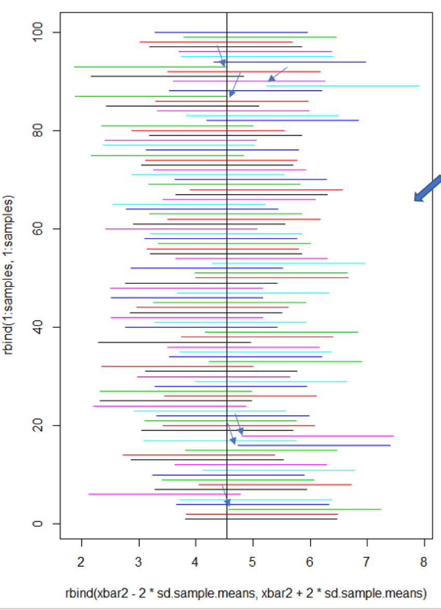

Compare Exoplanets candidate vs false positive duration variable
```R
summary(exo.candidates$koi_duration)
summary(exo.false.positive$koi_duration)

exo <- data.frame(duration = exo.candidates$koi_duration) #create dataframe
false <- data.frame(duration = exo.false.positive$koi_duration)

exo$variable <- 'candidate' # variable name
false$variable <- 'falsepositive'
exo.false.info <- rbind(exo, false)

ggplot(exo.false.info, aes(duration, fill = variable)) +
scale_x_continuous(limits = c(0.0, 30)) +
geom_density(alpha = 0.2)
```
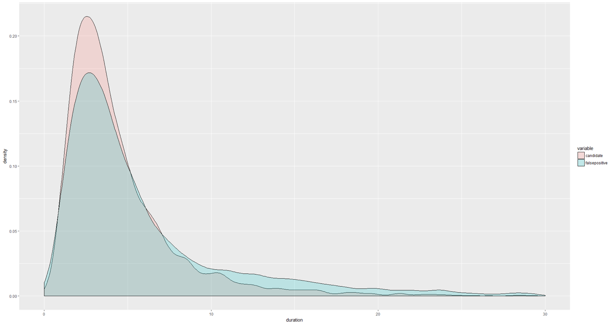
Boxplot 
```R
ggplot(data = exo.false.info, aes(x=variable, y=duration))  #boxplot
+ geom_boxplot(aes(fill=variable))
```
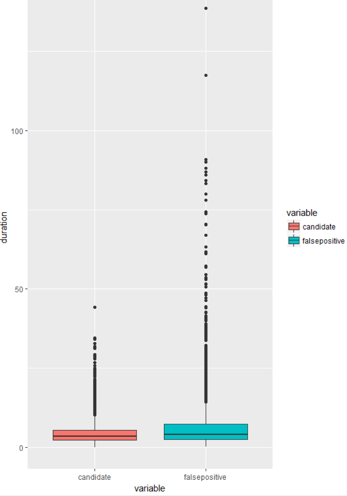

Exoplanet false positive compare density 
```R
ggplot(exo.false.info, aes(duration, fill = variable)) +
  scale_x_continuous(limits = c(0.0, 30)) +
  geom_density(alpha = 0.2) +
  geom_histogram(alpha = 0.5, aes(y = ..density..), position = 'identity')
```
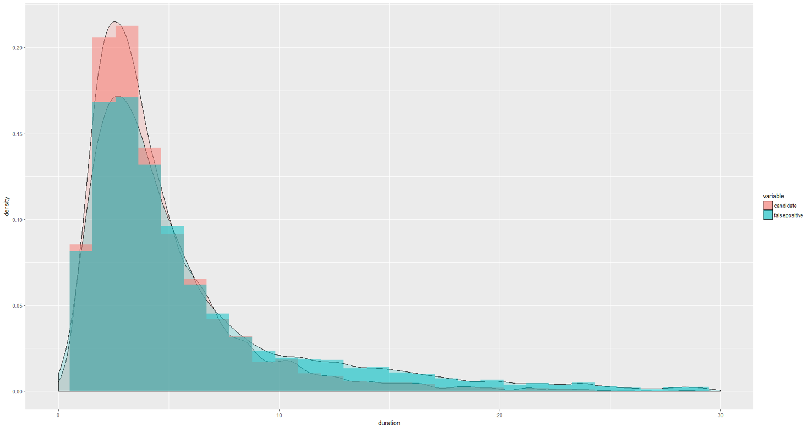


References
--------------
Kepler Exoplanet Search Results<br />
10000 exoplanet candidates examined by the Kepler Space Observatory<br />
https://www.kaggle.com/nasa/kepler-exoplanet-search-results/kernels<br />
NASA's Kepler mission doubles tally of exoplanets by weeding out impostors<br />
https://www.pbs.org/newshour/science/nasas-kepler-mission-doubles-tally-of-exoplanets-by-weeding-out-impostors<br />
The MEarth Project<br />
https://www.cfa.harvard.edu/MEarth/Science.html<br />
Exploratory data analysis of Kepler candidates dataset.<br />
https://www.kaggle.com/ezietsman/kepler-dataset-exploratory-analysis<br />
Using 'R' for betting analysis <br />
https://www.pinnacle.com/en/betting-articles/Betting-Strategy/r-betting-analysis/N7Y2W3F87V489ZDC <br />
How to Combine and Merge Sets in R <br />
http://www.dummies.com/programming/r/how-to-combine-and-merge-data-sets-in-r/ <br />
Ontotext Cooking data images <br />
https://www.slideshare.net/ontotext?utm_campaign=profiletracking&utm_medium=sssite&utm_source=ssslideview<br />
All the things<br />
http://knowyourmeme.com/memes/all-the-things<br />
Google Vis <br />
https://cran.r-project.org/web/packages/googleVis/vignettes/googleVis_examples.html<br />
ggplot Histograms<br />
https://www.r-bloggers.com/how-to-make-a-histogram-with-ggplot2/<br />
Histograms<br />
https://www.statmethods.net/graphs/density.html <br />
Histogram with curves<br />
https://stackoverflow.com/questions/1497539/fitting-a-density-curve-to-a-histogram-in-r<br />
Two Histogram together<br />
http://kanglinxm.blogspot.com/2014/08/plot-two-histograms-together-in-r.html <br />
