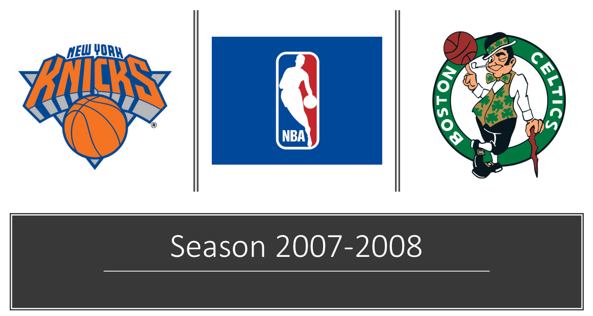
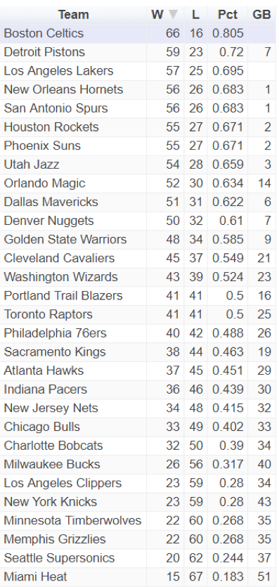
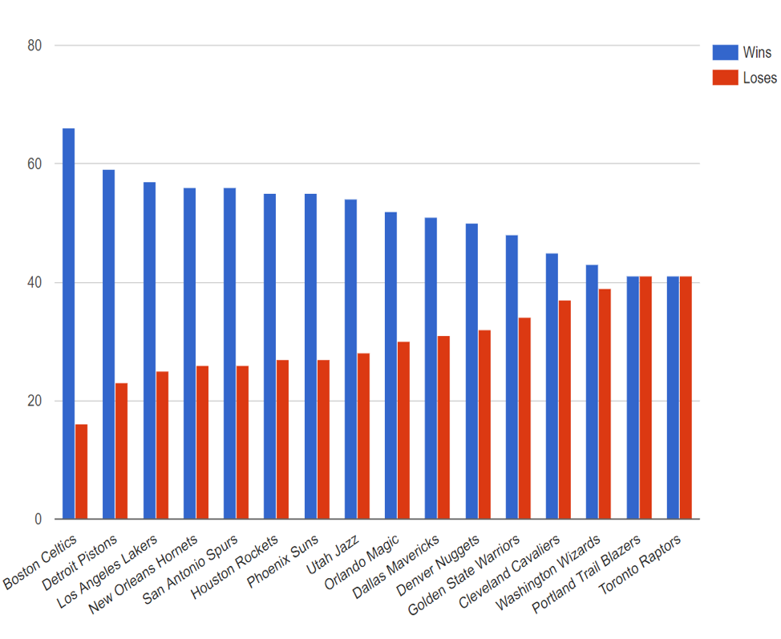
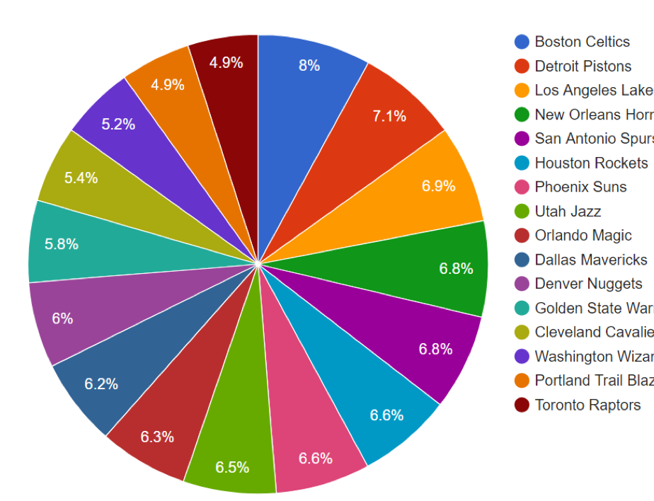
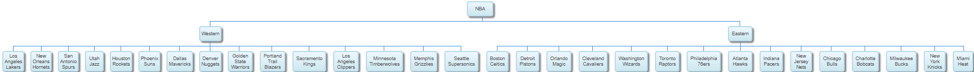
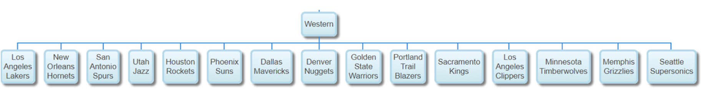
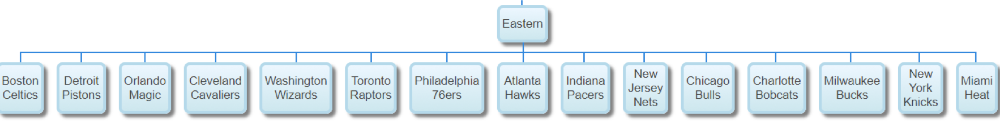
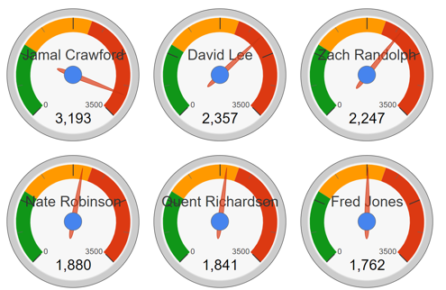
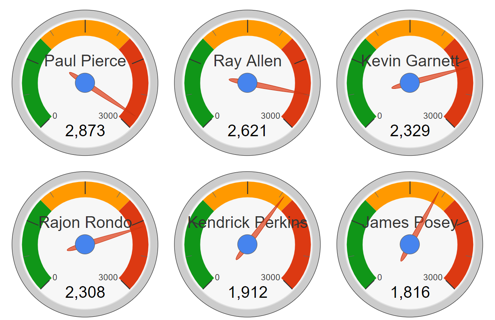
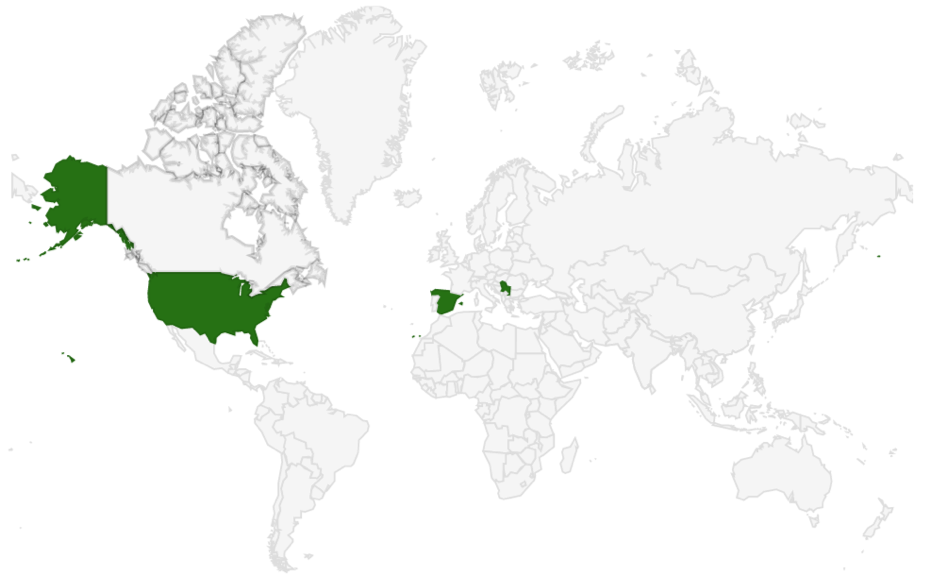

## R NBA Data Analysis

Sports Data Analytics term project:
Dataset: The website:
http://www.landofbasketball.com/championships/year_by_year.htm
http://www.landofbasketball.com/world_cup_stats/medals_by_year.htm



Retrieve the NBA data for the 2007-2008 season.
```R
library(googleVis)
library(RCurl)
library(RJSONIO)
library(SportsAnalytics)
library(XML)
library(stringr)
setwd("path")
getwd()
nba.season <- "07-08"
nba.data <- fetch_NBAPlayerStatistics(nba.season)
save(nba.data, file="nba.data.RData")
load(file="nba.data.RData")
names(nba.data)
```
NBA google visualization Table
```R
nba.table.chart <- gvisTable(nba[,c("Team", "W", "L", "Pct", "GB")])
plot(nba.table.chart)
```



NBA top 16 Wins/Loses google column chart
```R
nba.wins<- aggregate(nba$W,by = list(nba$Team),FUN = "sum")
names(nba.wins)<-c("Team","Wins")
head(nba.wins[order(-nba.wins$Wins),],5) #top 5
nba.loses<- aggregate(nba$L,by = list(nba$Team),FUN = "sum")
names(nba.loses)<-c("Team","Loses")
nba.wl <- merge(nba.wins,nba.loses,by = "Team",sort = FALSE)
nba.chart.column <-  gvisColumnChart(head(nba.wl[order(-nba.wl$Wins),],16), 
                                     options=list(width=1300, height=800))
plot(nba.chart.column)
```


NBA top 16 Wins google pie chart 
```R
nba.pct<- aggregate(nba$Pct,by = list(nba$Team),FUN = "sum")
names(nba.pct)<-c("Team","Pct")
nba.chart.pie <-  gvisPieChart(head(nba.pct[order(-nba.pct$Pct),],16), 
                               options=list(width=1300, height=800))
plot(nba.chart.pie)
```


NBA Google Organization  Chart
```R
conference <- c()
name <- c("Western","Eastern")
conference[1] <- NA
conference[2] <- "NBA"
conference[3] <- "NBA"
conference[4:18]<- unique(name)[1]
conference[19:33]<- unique(name)[2]
conference
newnode<- c(c("NBA"),name,nba$Team)
newnode
data = data.frame(
  Node =  newnode,
  Parent = conference,
  val = 1:33
)

conference.org.chart <- gvisOrgChart(
  data,idvar="Node", parentvar="Parent",tipvar="val", 
  options=list(width=1000, height=800, allowCollapse=TRUE))
plot(conference.org.chart)
```




NBA Knicks/ Celtics minute played Google Gauge

```R
knicks.minutes.gauge <- gvisGauge(head(knicks.minutes[order(-knicks.minutes$TotalMinutesPlayed),],6),
                           options=list(min=0, max=3500,greenFrom=0, greenTo=1000,
                                        yellowFrom=1000, yellowTo=2000,redFrom=2000, redTo=3500,width=1000, height=1000))
plot(knicks.minutes.gauge)

celtics.minutes.gauge <- gvisGauge(head(celtics.minutes[order(-celtics.minutes$TotalMinutesPlayed),],6),
                                  options=list(min=0, max=3000,greenFrom=0, greenTo=1000,
                                               yellowFrom=1000, yellowTo=2000,redFrom=2000, redTo=3000,width=1000, height=1000))
plot(celtics.minutes.gauge)
```

Knicks Players



Celtics 



##Basketball World Cup Champions

With gvisGeoChart function to display the location on the world map of the last 5 Basketball World Cup Champions that you can find at: 
http://www.landofbasketball.com/world_cup_stats/medals_by_year.htm

```R
webpage <- paste0("http://www.landofbasketball.com/","world_cup_stats/medals_by_year.htm")
wc <- readHTMLTable(webpage, which = 1, stringsAsFactors = FALSE)
names(wc)<-c("WorldCup","Space", "Gold", "Silver", "Bronze")
wc <- subset(wc, select = c("WorldCup", "Gold", "Silver", "Bronze")) #remove space column 
wc <- na.omit(wc) # remove NA rows
wc <- wc[2:nrow(wc), ] #remove first element of the table (table headers)
wc.winners <- subset(wc, select = c("WorldCup","Gold")) 
wc.winners$Gold[wc.winners$Gold=="FR of Yugoslavia"] <- "Serbia"
head(wc.winners, 5)
wc.winners.geochart <- gvisGeoChart(head(wc.winners,5),"Gold","WorldCup")
plot(wc.winners.geochart)
wc.winners
```

