## Data Visualization with R

histogram of the duration of days of hospital stays.  Ensure the histogram is labelled appropriately. 
Use a width of 1 day. 
```R
library(xlsx)
data <- read.xlsx("hospital_days.xlsx",1)
hospital.days = c()
for(i in names(data)){ #[2]
  for (v in data[[i]]) # looping the number from each column
    hospital.days <- c(hospital.days, v)
}
hist(hospital.days, 
     main="duration of days of hospital stays", 
     xlab="Days", 
     border="blue", 
     col="green",
     breaks=seq(0,15) 
)
```
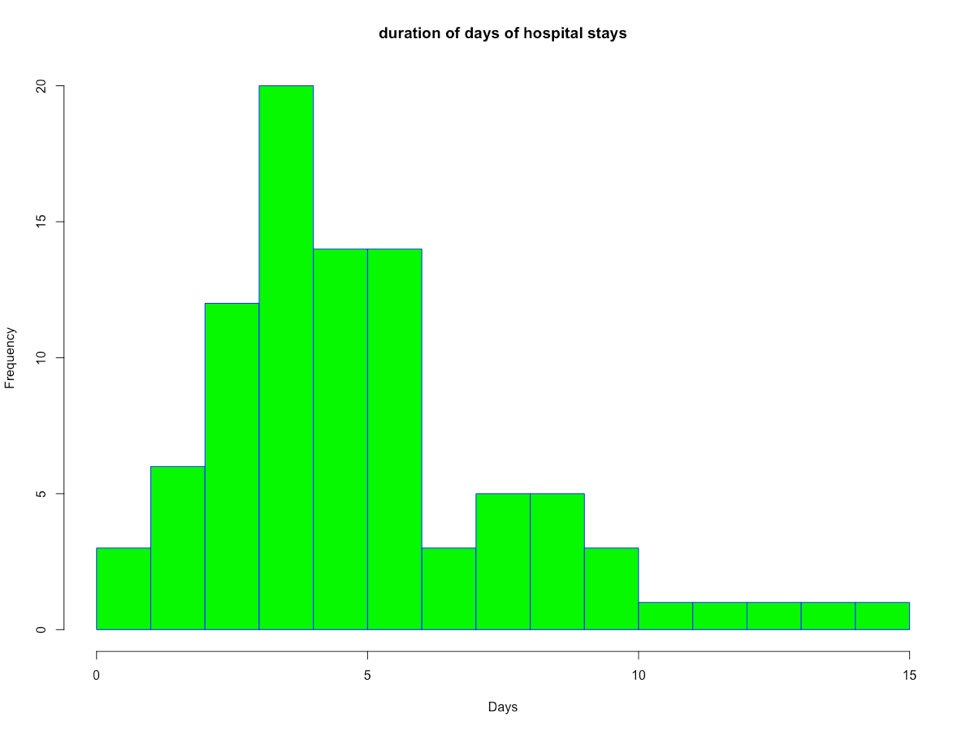

Boxplot, we can see the outliers which in this case are all the values over 9. (10 11 12 13 14 15)
```R
boxplot(hospital.days, horizontal=TRUE, xaxt="n", col="green")
axis(side=1, at=five.num, labels=TRUE)
text(five.num, rep(1.2,5), srt=90, adj=0, labels=c("Min","Lower Hinge","Median","Upper Hinge","Max")) 
outliers.days <- boxplot(hospital.days, plot = FALSE)$out #only get the outliers
```
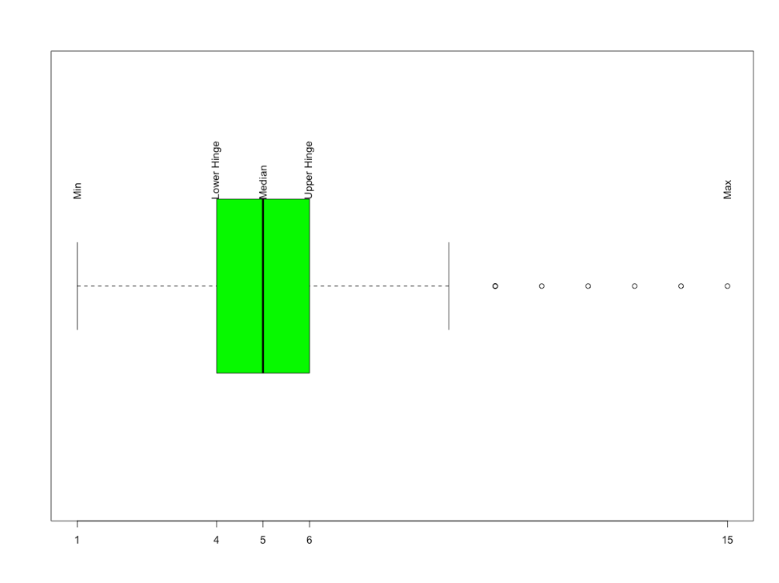


Histogram Participants vs No Participants 
```R
library(xlsx) # to read the xml 
data <- read.xlsx("calories_intake.xlsx", 1)
noparticipants<- na.omit(data$noparticipants) # remove the NA fields
par(mfrow=c(1, 2)) 
hist(data$participants, 
     main="Participants: calorie intake for that meal", 
     xlab="Calories", 
     border="red", 
     col="green"
)

hist(data$noparticipants, 
     main="No Participants: calorie intake for that meal", 
     xlab="Calories", 
     border="red", 
     col="green"
)
```
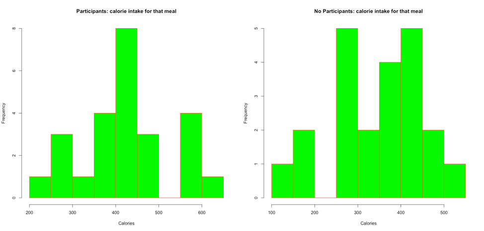
ggplot Histogram 

```R
par(mfrow=c(1, 2)) 
library(ggplot2)
library(ggpubr) # to put two histogram together
part.ggplot <-ggplot(data=data, aes(data$participants)) + 
geom_histogram(aes(y =..density..), 
               #breaks=seq(), 
               bins = 8,
               col="red", 
               fill="green", 
               alpha=.2) + 
geom_density(col=2)+
geom_vline(aes(xintercept=mean(data$participants)), color="blue", linetype="dashed", size=0.5) +
labs(title="Participants: calorie intake for that meal", x="calories", y="Counts")
noparts.mean <-mean(noparticipants)
noparts.mean
#histogram for no particupants
nopart.ggplot <- ggplot(data=data, aes(data$noparticipants)) + 
geom_histogram(aes(y =..density..), 
               #breaks=seq(), 
               bins = 10,
               col="red", 
               fill="green", 
               alpha=.2) + 
geom_density(col=2) + 
geom_vline(aes(xintercept=noparts.mean), color="blue", linetype="dashed", size=0.5) +
labs(title="No Participants: calorie intake for that meal", x="calories", y="Counts")
```
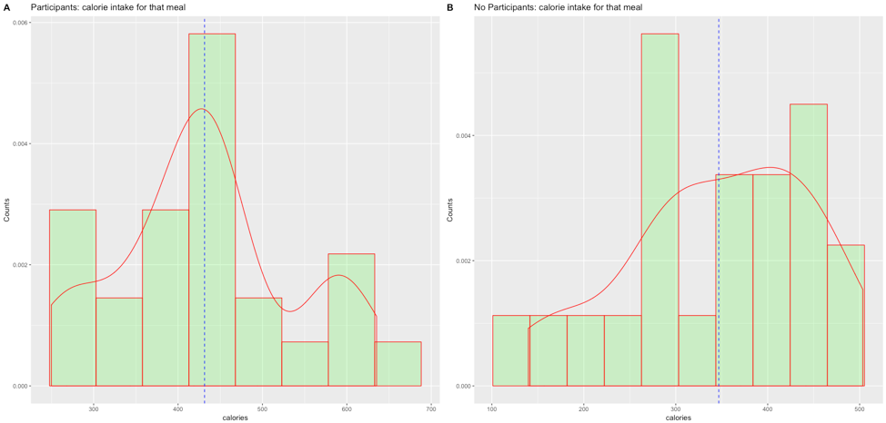


Boxplot Participants vs No Participants

```R
boxplot(data$participants, horizontal=TRUE, xaxt="n", col="green", main="Participants")
axis(side=1, at=fivenum(data$participants), labels=TRUE)
text(fivenum(data$participants), rep(1.2,5), srt=90, adj=0, labels=c("Min","Lower Hinge","Median","Upper Hinge","Max")) 
boxplot(noparticipants, horizontal=TRUE, xaxt="n", col="lightblue", main="no participants")
axis(side=1, at=fivenum(noparticipants), labels=TRUE)
text(fivenum(noparticipants), rep(1.2,5), srt=90, adj=0, labels=c("Min","Lower Hinge","Median","Upper Hinge","Max")) 
```
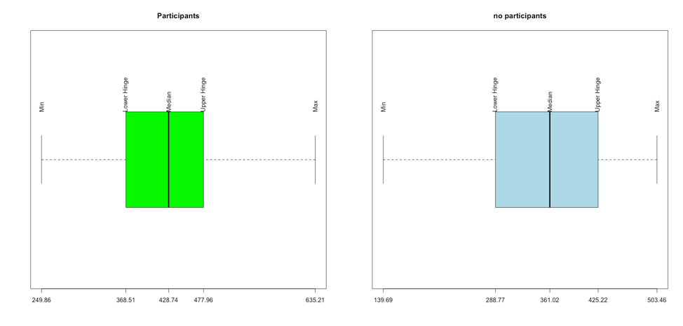

Scatterplot with labs, and controlling axes <br/>
ggplot scatter plot of the data was easier to read 
```R
library(xlsx) # to read the xml 
library(ggplot2)
data <- read.xlsx("meal_fishs.xlsx", 1)

ggplot(data, aes(x=data$meal.with.fish, y=data$Total.Mercury)) + 
  geom_point()+
  labs(title="Scatterplot of Meal with fish vs Total Mercury", x="Meals with Fish", y="Total Mercury (mg/g)" )
```
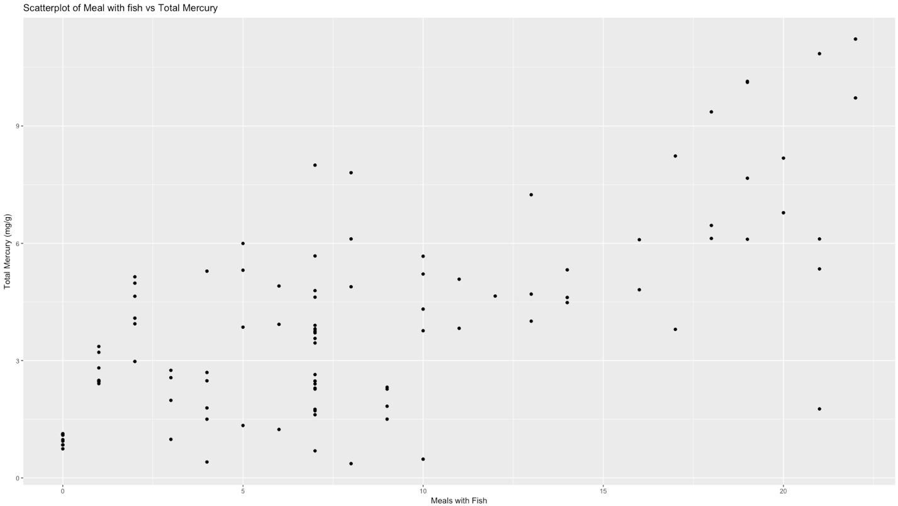

The regression line to the scatterplot.

```R
plot(data$meal.with.fish,data$Total.Mercury, 
     main="Scatterplot of Meal with fish vs Total Mercury",
     xlab = "Meals with Fish", ylab="Total Mercury (mg/g)" , cex = .9)
abline(lsfit(data$meal.with.fish, data$Total.Mercury)$coefficients,col="red")
```
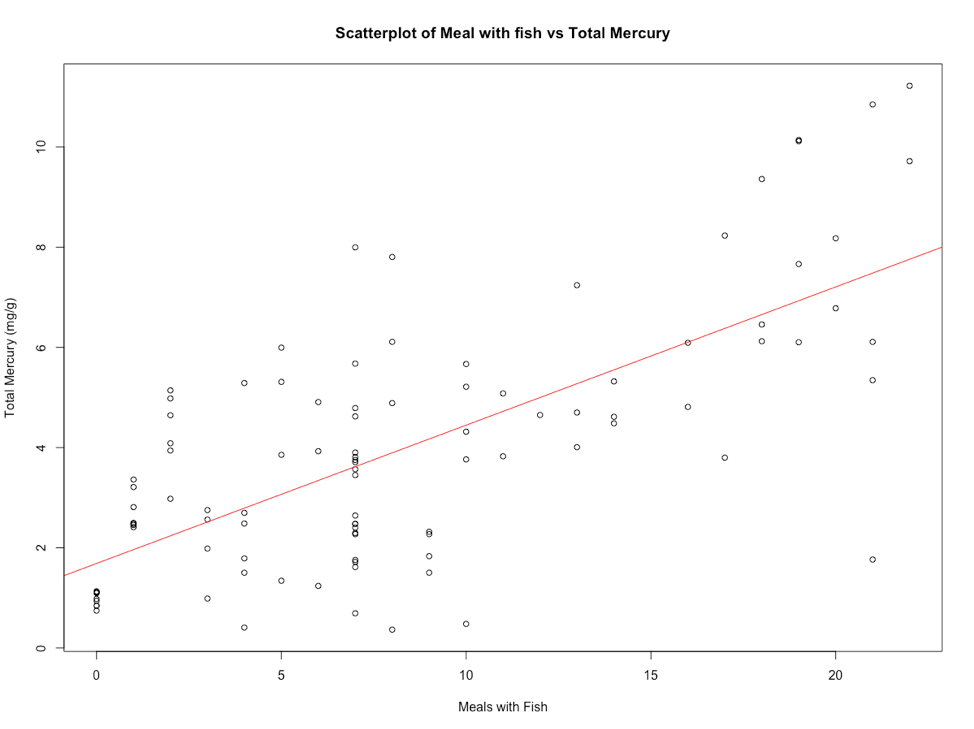
The regression line to the scatterplot using ggplot library
```R
ggplot(data, aes(x=data$meal.with.fish, y=data$Total.Mercury)) + 
geom_point()+
labs(title="Scatterplot of Meal with fish vs Total Mercury", x="Meals with Fish", y="Total Mercury (mg/g)" )+
geom_smooth(method=lm, se=TRUE)
```
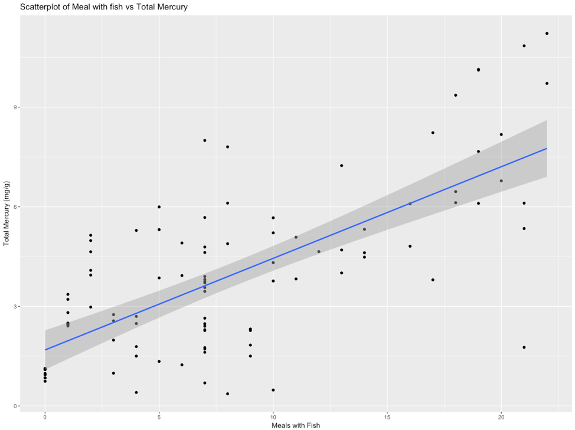

Scatterplot to examine the association between prestige score and years of education.
```R
library(xlsx) # to read the xls
data <- read.xlsx("hw4.xlsx", 1)
summary(data)

x<-data$Education.Level#independent variable
y<-data$Prestige.Score        #dependent variable
xlabel <- "Education Level (years)"
ylabel <- "Prestige Score"
par(mfrow=c(1, 1)) # need 1x1layout
library(ggplot2)
ggplot(data, aes(x=x, y=y)) + 
  geom_point()+
  labs(title="Scatterplot of Education Level vs Prestige Score", x=xlabel, y=ylabel )+
  geom_smooth(method=lm, se=TRUE)
cor(y,x)
cor.test(y,x)
```
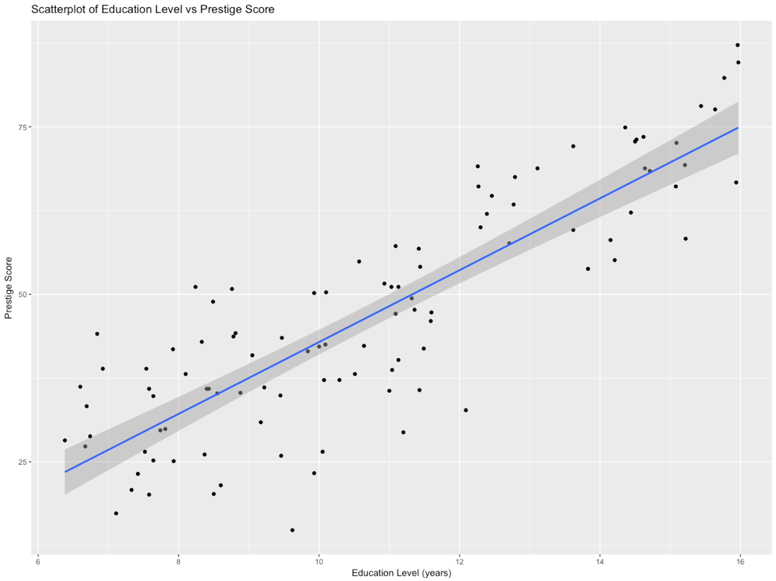

Simple linear regression.  Generate a residual plot. 

```R
lm(y~x)
m<-lm(y~x)
summary(m)

plot(x,resid(m), axes=TRUE, frame.plot=TRUE, xlab = xlabel, ylab="residuals") 
abline(h=0)
```
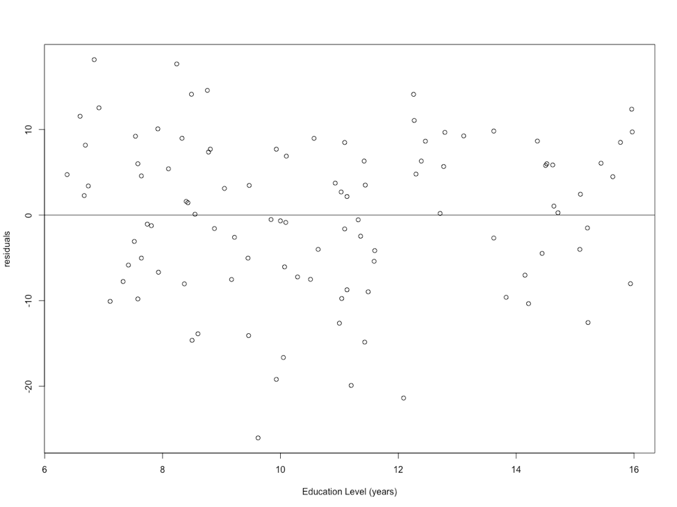

Residual and fitted values from the model
```R
model = lm(formula = y ~ x)
resid = resid(model)
fitted = fitted(model)
hist(x = resid, main = "Residuals", breaks = 20)
plot(density(x = resid), main = "Residuals")
```
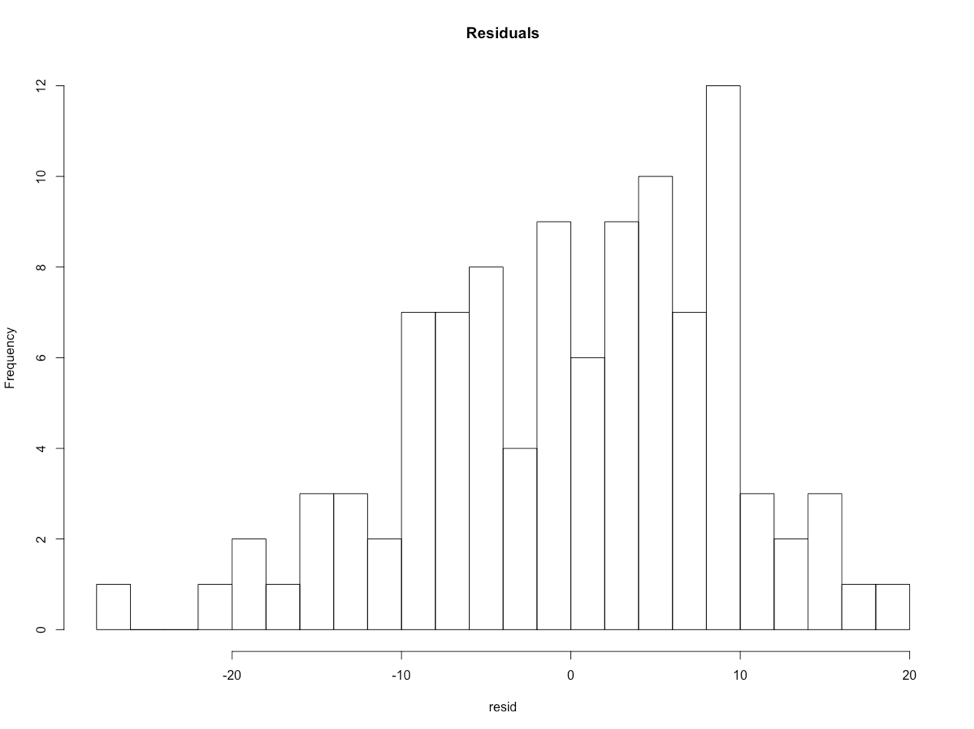
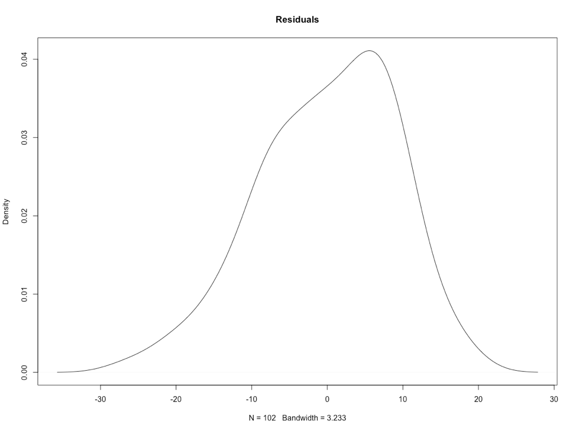
Residuals Histogram
```R
df<- data.frame(resid = resid)
ggplot(data=df, aes(df$resid)) + 
  geom_histogram(aes(y =..density..), 
                 #breaks=seq(), 
                 bins = 10,
                 col="red", 
                 fill="green", 
                 alpha=.2) + 
  geom_density(col=2) + 
  labs(title="Residuals Histogram", x="Residuals", y="Counts")
```
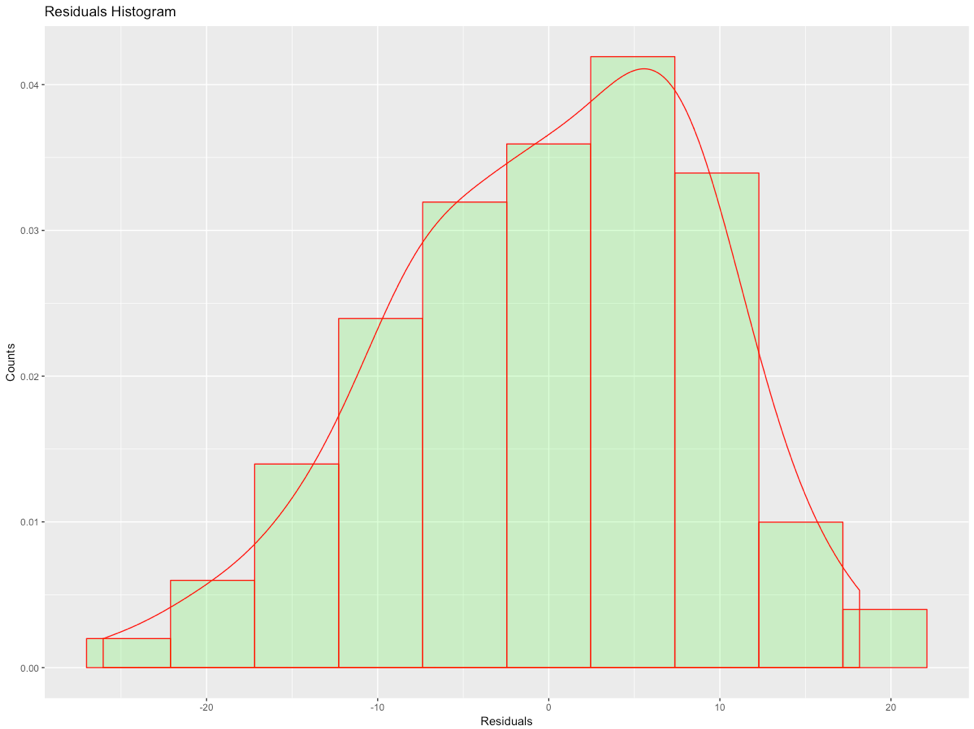

Outliers and influence points 
```R
library(car)

(outs <- influencePlot(m))
n <- 2
Cooksdist <- as.numeric(tail(row.names(outs[order(outs$CookD), ]), n))
Lev <- as.numeric(tail(row.names(outs[order(outs$Hat), ]), n))
StdRes <- as.numeric(tail(row.names(outs[order(outs$StudRes), ]), n))

outs
df <- data.frame(x=x, y=y)

plot(df$x, df$y, xlab = xlabel, ylab = ylabel)
abline(m, col = "blue")
points(df$x[Cooksdist], df$y[Cooksdist], col = "red", pch = 0, lwd = 15)
points(df$x[Lev], df$y[Lev], col = "blue", pch = 25, lwd = 8)
points(df$x[StdRes], df$y[StdRes], col = "green", pch = 20, lwd = 5)
text(df$x[as.numeric(row.names(outs))], 
     df$y[as.numeric(row.names(outs))], 
     labels = paste("", sep ="x", ""),
     pos = 1)
```
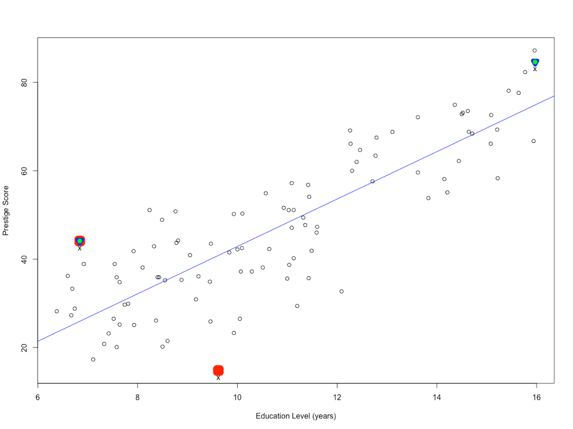

The least squares regression equation that predicts prestige from education, income and percentage of women
```R
m<-lm(data$Prestige.Score~data$Education.Level+data$Income+data$Percent.of.Workforce.that.are.Women)
summary(m)
anova(m)

x<-data$Education.Level#independent variable
y<-data$Prestige.Score          #dependent variable
df <- data.frame(
                 income = data$Income+data, 
                 prestige.score = data$Prestige.Score,
                 education = data$Education.Level+data,
                 women = data$Percent.of.Workforce.that.are.Women
                   )
pairs(data,upper.panel=panel.cor, diag.panel=panel.hist, lower.panel=panel.lm)
pairs(data)
cor(data)
```
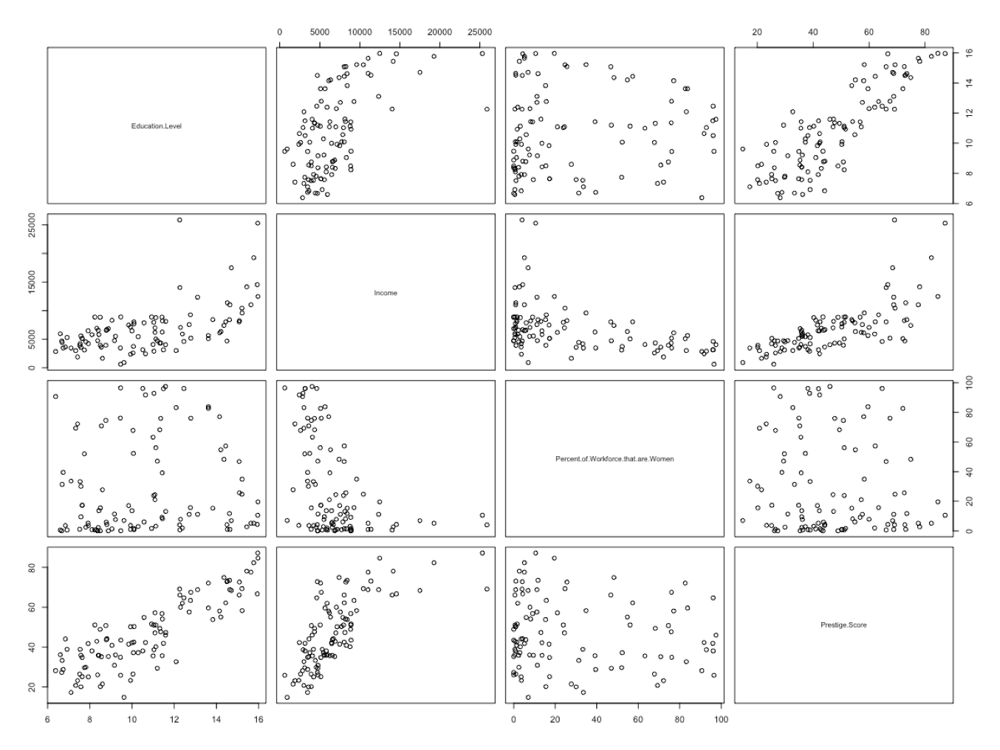
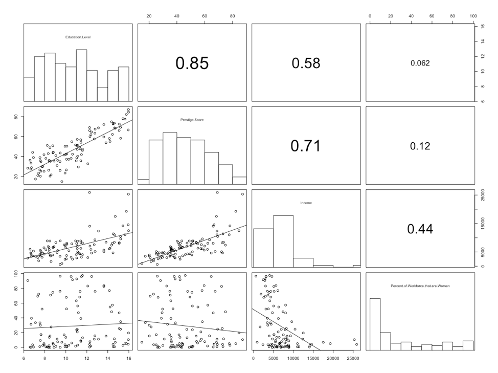

Residual plot showing the fitted values from the regression against the residuals.

```R
plot(fitted(m),resid(m), axes=TRUE, main="Fitted Values vs Residuals", frame.plot=TRUE, xlab = "fitted values", ylab="residuals")
abline(h=0)
```
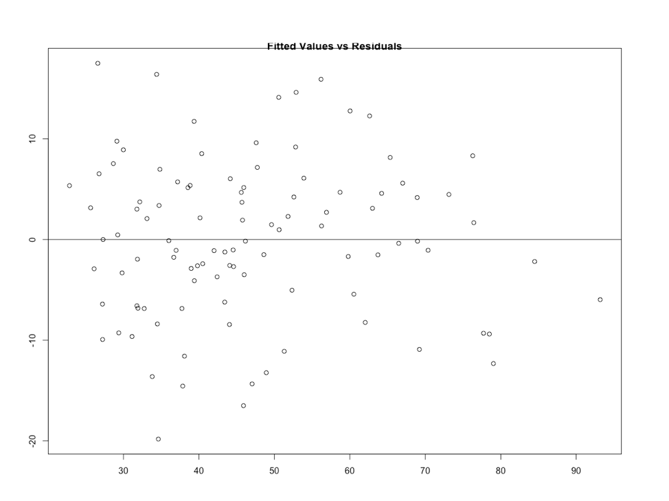

Residuals vs Fitters 
```R
plot(m, pch=16, which=1)
```
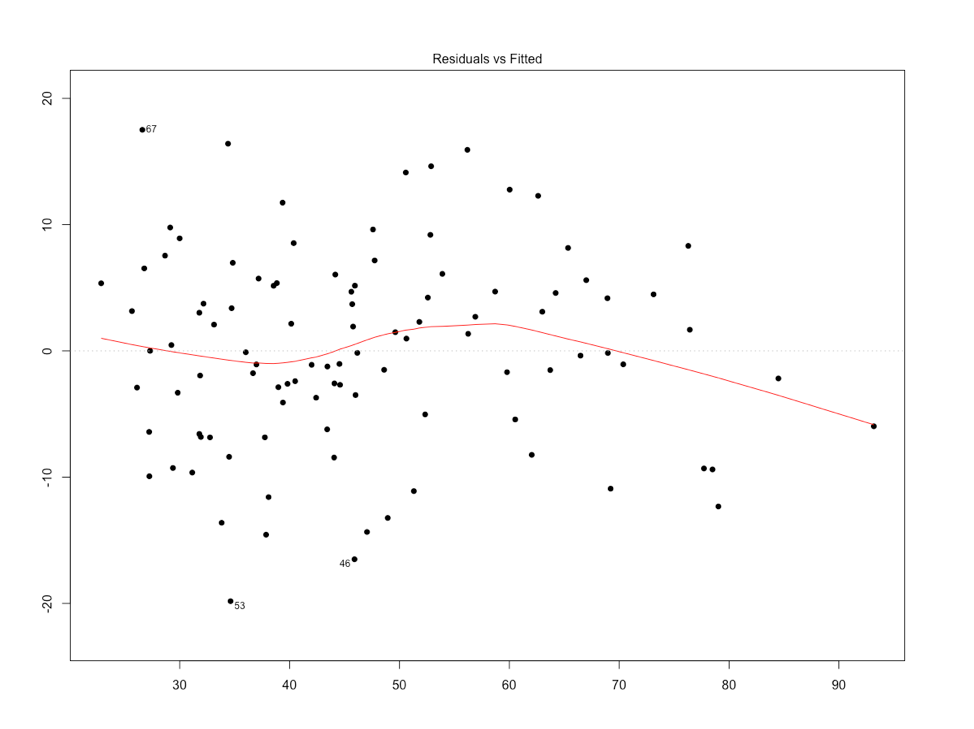

Histogram for Residuals Multiple Regression

```R
df <- data.frame(resid = resid(m))

ggplot(data=df, aes(df$resid))+ 
  geom_histogram(aes(y =..density..), 
                 col="red", 
                 fill="green", 
                 alpha = .2) + 
  geom_density(col=2) + 
  labs(title="Histogram for Residuals Multiple Regression") +
  labs(x="Residuals", y="Count")
```
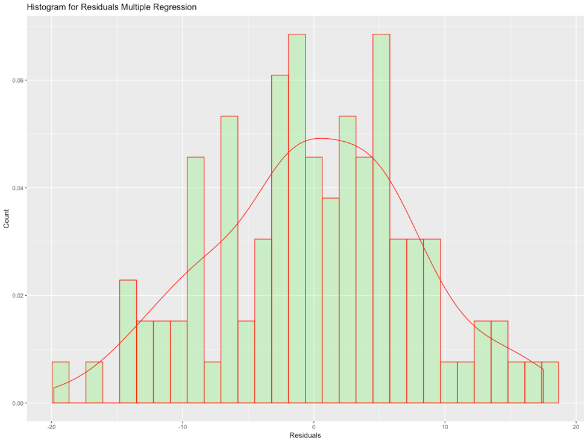

logistic regression with sex as the only explanatory variable.  ROC Curve
```R
library(xlsx) # to read the xls
library(pROC)
data <- read.xlsx("body_rate.xlsx", 1)
summary(data)
m<-glm(data$temp_level ~ data$sex1, family = binomial)
summary(m)

predpr <- predict(m, type=c("response"))
g <- roc(data$temp_level ~ predpr)
plot(g) 
plot(1-g$specificities, g$sensitivities, type = "l",
     xlab = "1 - Specificity", ylab = "Sensitivity", main = "ROC Curve")
abline(a=0,b=1)
grid()
auc(g)
```
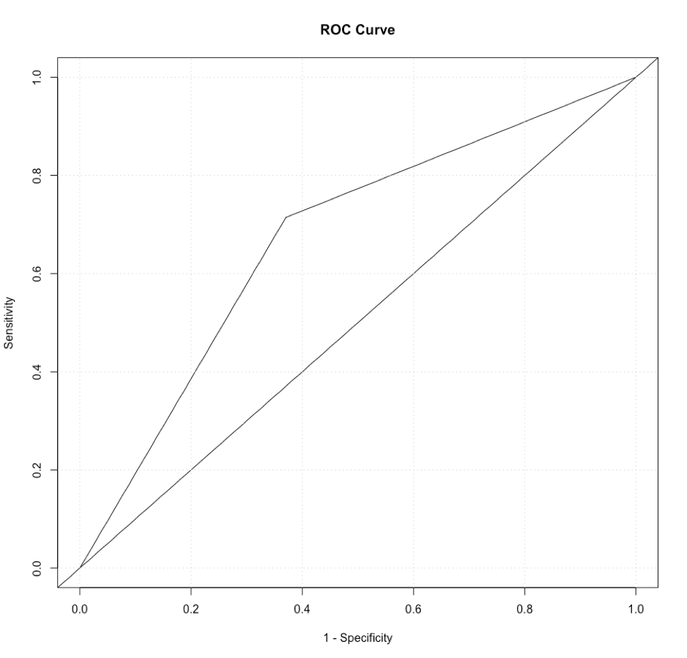

Perform a multiple logistic regression predicting body temperature level from sex and heart rate.
```R
m<-glm(data$temp_level ~ data$sex1+data$heartrate, family = binomial)
summary(m)

exp(cbind(OR = coef(m), confint.default(m)))
library(aod)
wald.test(b = coef(m2), Sigma = vcov(m2), Terms = 2:4)
predpr <- predict(m, type=c("response"))
g <- roc(data$temp_level ~ predpr)
plot(g) 
plot(1-g$specificities, g$sensitivities, type = "l",
     xlab = "1 - Specificity", ylab = "Sensitivity", main = "ROC Curve")
abline(a=0,b=1)
grid()

auc(g)

exp(m$coefficients[1]+m$coefficients[2]+m$coefficients[3]*10)/(1+exp(m$coefficients[1]+m$coefficients[2]*190+m$coefficients[3]*10))
```
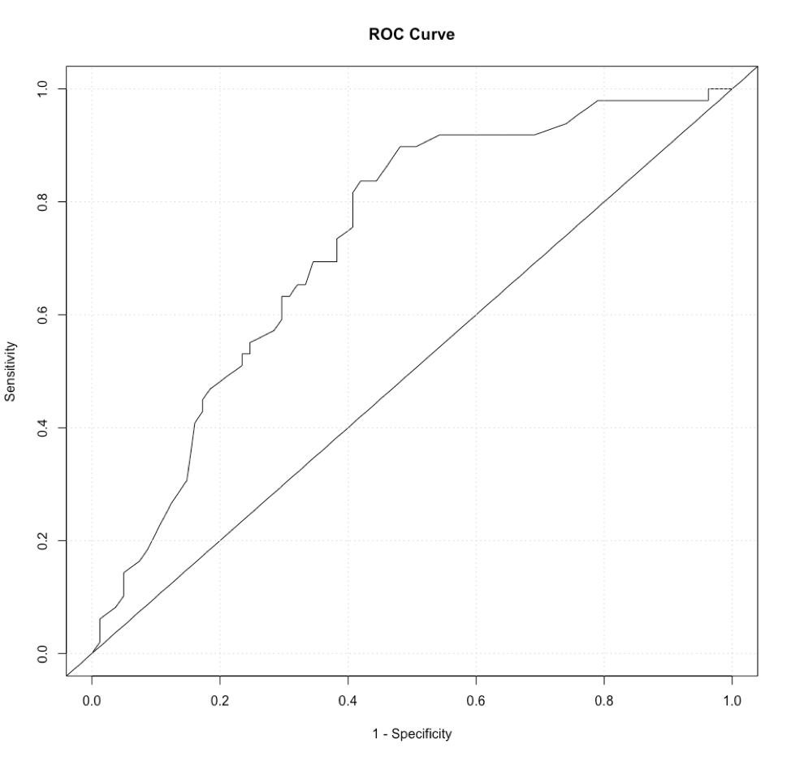