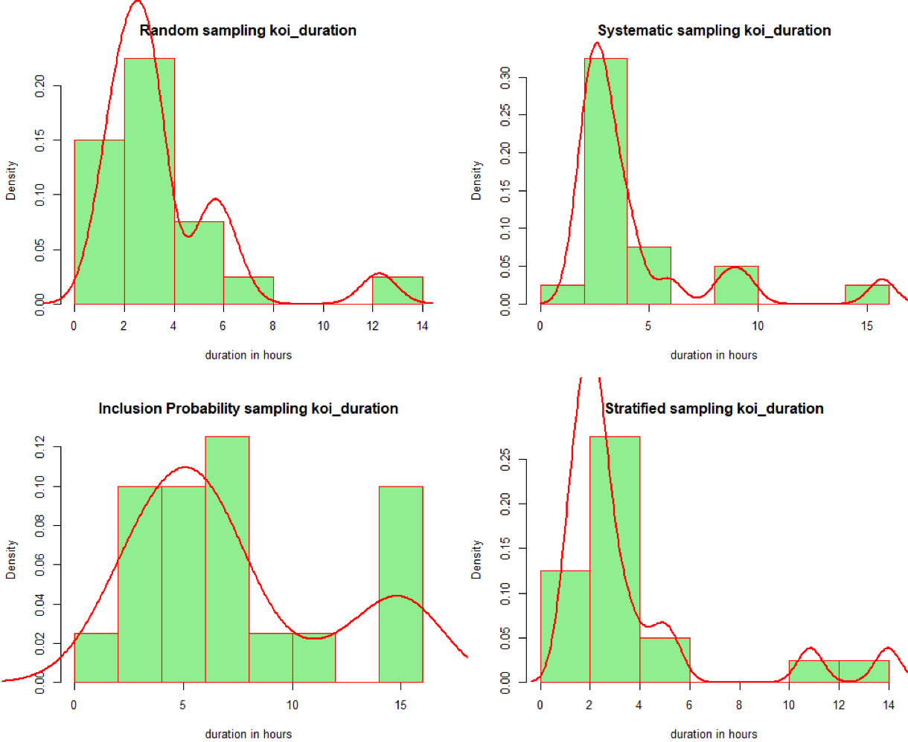

## Welcome to @Fr4nc3 github sample code

### Francia Riesco

```markdown
Professional software developer and Research Scientist Interested in 
Data Science and Computational Astrophysics. 
I have experience programming in several language such as:
C#, PHP, C, R, PYTHON, Java.
Also, database architect such as:
SQL Server, Oracle, MySQL, PostgreSQL and MongDB.
```

Exoplanets analysis with R


NBA analysis and Visualization with R


Magellanic Clouds  Fits image with Catalog Object detected with Python (astropy lib)


JSON external api call and used as result feed example with NODE and Express
```JS
var URL = 'http://ori-nodeassets.nbcnews.com/elections/2018-05-08/races_S_counties.json';
router.get('/races/:variable*?', function (req, res, next) {
    axios.get(URL).then(function (response) {  
      res.json(dal.apiRaces(req.params.variable, response.data));
    });

});
```

