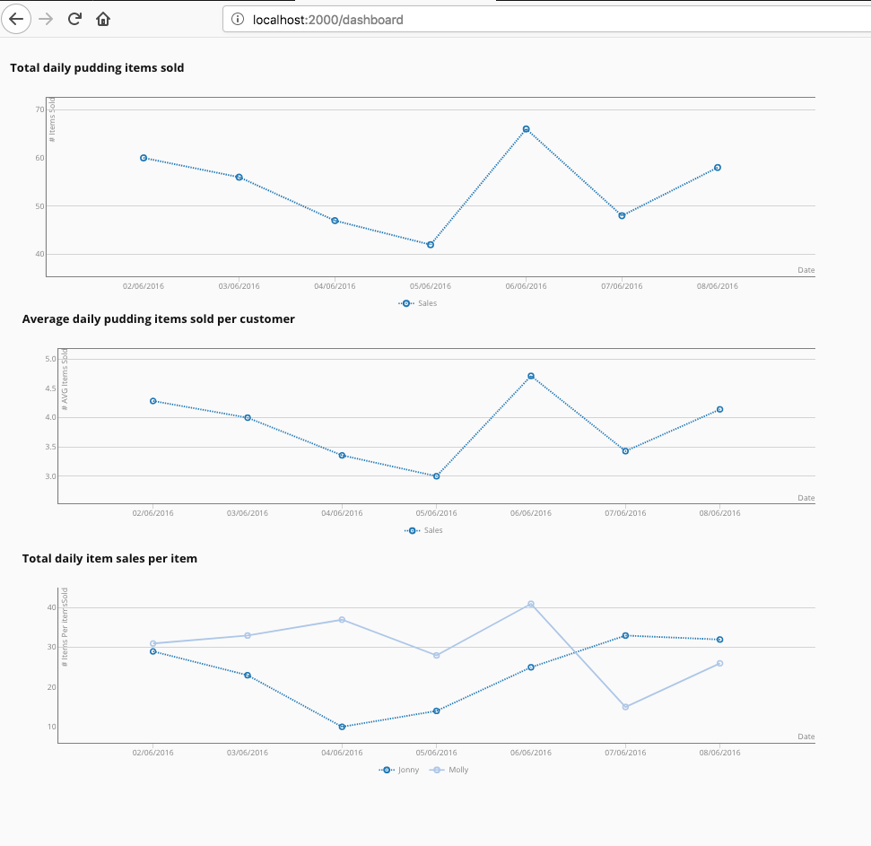

## CSV CHART with NodeJs, ExpressJs and AngularJs


## Installation

To install packages: 
```
npm install
```
To start the application: 
```
npm start
```

#### I installed csv-load-sync to read the csv file [1]
to install csv-load-sync : 
```
npm install csv-load-sync
```

### angular chart was aleady installed but in case we need it [3]
to install angular-chart: 
```
bower install --save angular-chart.js
```


### Display the 3 graph




## THIS WAS AN IBM EXCERSISE 


VisualStudio Code Version 1.19.2 (1.19.2)
nmp -v 5.60
bower -v 1.8.2


### References 

[1] https://www.npmjs.com/package/csv-load-sync

[2] https://www.npmjs.com/package/angular-chart.js/

[3] https://medium.com/@danacodes/alasql-a-query-language-for-javascript-e1540ac238b4 