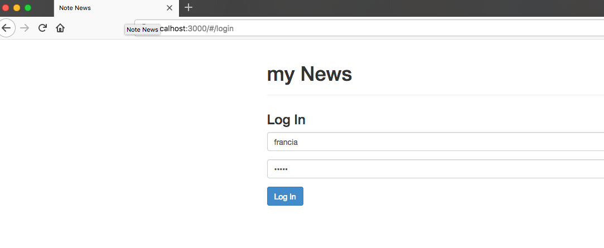
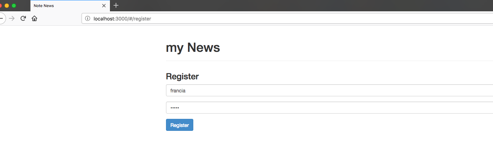
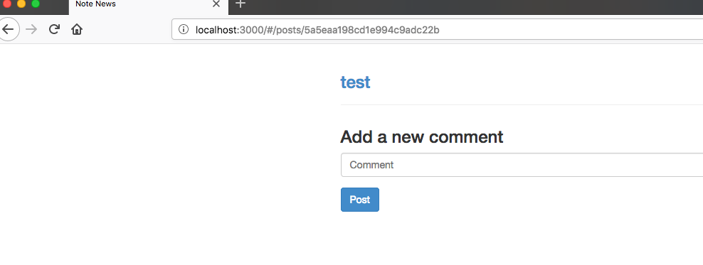

### Note News 

This is a MEAN sample code where we create a site login and add comments and vote using MongoDB

```
npm install
```

```
npm start
```


Angular Controler configuration:

```JS
var app = angular.module('notesNews', ['ui.router']);
app.config([
  '$stateProvider',
  '$urlRouterProvider',
  function ($stateProvider, $urlRouterProvider) {

    $stateProvider
    .state('login', {
      url: '/login',
      templateUrl: '/login.html',
      controller: 'AuthCtrl',
      onEnter: ['$state', 'auth', function($state, auth){
        if(auth.isLoggedIn()){
          $state.go('home');
        }
      }]
    })
    .state('register', {
      url: '/register',
      templateUrl: '/register.html',
      controller: 'AuthCtrl',
      onEnter: ['$state', 'auth', function($state, auth){
        if(auth.isLoggedIn()){
          $state.go('home');
        }
      }]
    })
      .state('posts', {
        url: '/posts/{id}',
        templateUrl: '/posts.html',
        controller: 'PostsCtrl',
        resolve: {
          post: ['$stateParams', 'posts', function($stateParams, posts) {
            return posts.get($stateParams.id);
          }]
        }
      })
      .state('home', {
        url: '/home',
        templateUrl: '/home.html',
        controller: 'MainCtrl',
        resolve: {
          postPromise: ['posts', function (posts) {
            return posts.getAll();
          }]
        }
      });

    $urlRouterProvider.otherwise('home');
  }
]);
```










