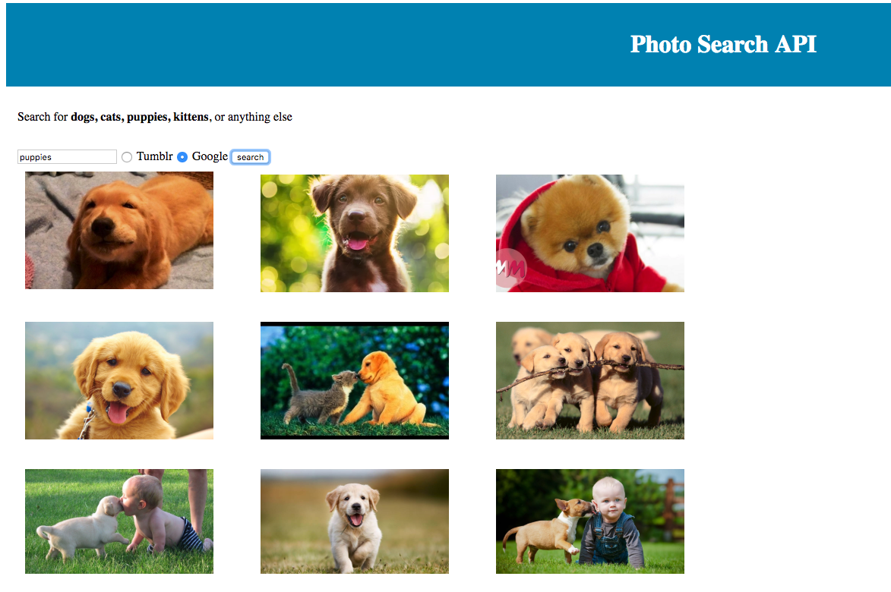

Vanilla JS photo search api with Tumblr or Google API
====================================================

Online demo:
---------------------

[http://www.fr4nc3.com/samples/](http://www.fr4nc3.com/samples/)


you can test in your local environement using python! 

python 2.7
```
python2.7 -m SimpleHTTPServer 8000
```
python 3.+
```
python -m http.server 8080
```
### Parse google json API results
```js
function googleSuccess(data) {
    var list = data.hasOwnProperty("items") ? data.items.map(x => ({
        images: [{
            caption: x.title,
            originalSize: x.link,
            sizes: [{
                    width: x.image.thumbnailWidth,
                    url: x.image.thumbnailLink
                },
                {
                    width: x.image.width,
                    url: x.link
                }
            ]
        }]
    })) : [];
    populate(list);

};
```
### Parse tumblr json API results
```js
function tumblrSuccess(data) {
    var list = data.hasOwnProperty("response") ? data.response.filter(x => x.type == "photo").map(x => ({
        images: [{
            caption: x.caption,
            originalSize: x.photos[0].original_size.url,
            sizes: x.photos[0].alt_sizes.map(p => ({
                width: p.width,
                url: p.url
            }))
        }]
    })) : [];
    populate(list);
};
```
### ajax for cross domain api call:
```js
function getCORS(url, success) {
    var xhr = new XMLHttpRequest();
    if (!('withCredentials' in xhr)) xhr = new XDomainRequest(); // fix IE8/9
    xhr.open('GET', url);
    xhr.onload = success;
    xhr.send();
    return xhr;
};
```

### Example:




References
---------------------

1. https://plainjs.com/
2. https://javascript.info/ 
3. https://tumblr.github.io/tumblr.js/tumblr.js.html
4. https://www.cssscript.com/minimal-modal-window-with-plain-javascript/
5. http://www.ajaxload.info/
