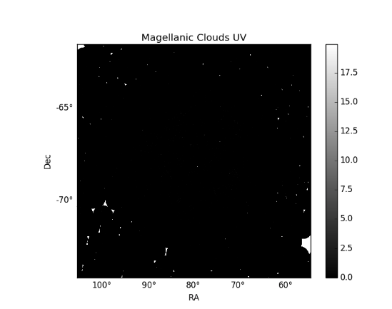
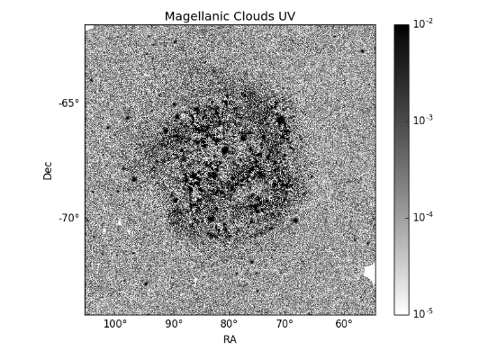
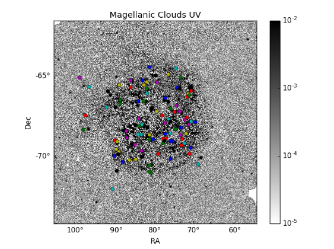
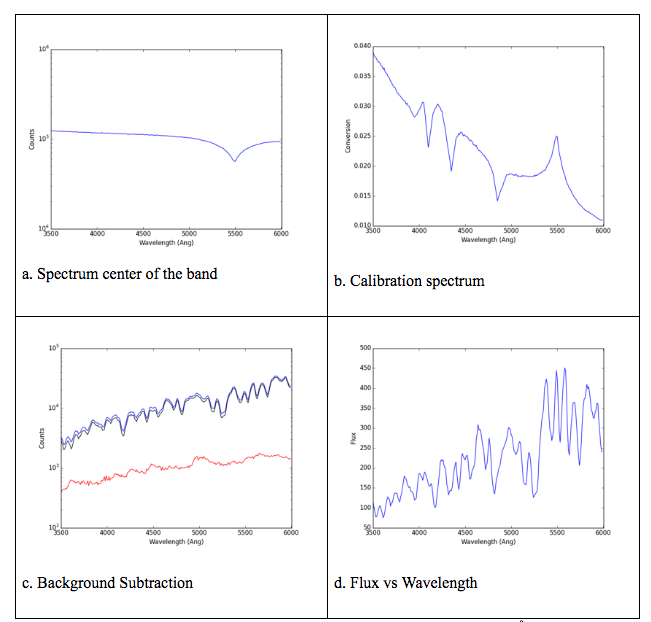
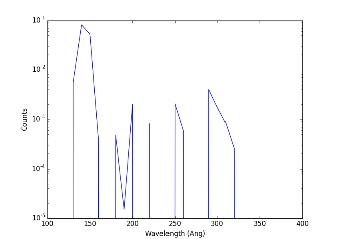
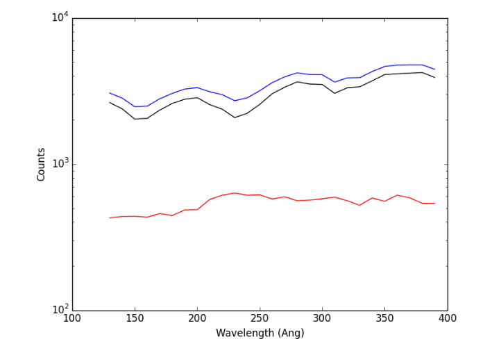
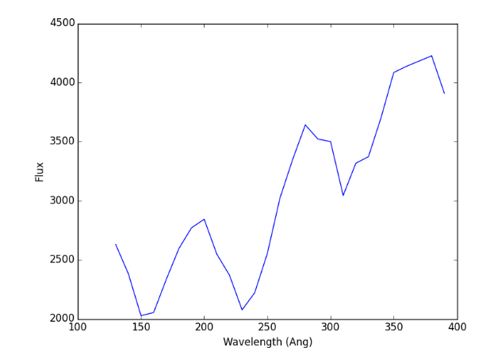

### The Photometric Analysis of the Magellanic Clouds

The Galaxy Evolution Explorer (GALEX) satellite was an orbiting space telescope that observed galaxies at ultraviolet wavelengths. GALEX picked up an assortment of astronomical objects while surveying distant galaxies. The satellite's large field of view is 1.5° of sky.  Also, the capabilities of the GALEX cameras allow photon counting that takes a picture about once every 0.05 second. This American ultraviolet astronomy satellite was launched on April 28th 2008 and collected more than 200 million source measurements at far-UV (FUV) and near-UV (NUV) wavelengths and images of extended objects.
With the help of  GALEX, astronomers observed  the Milky Way's nearest neighbor galaxy the Magellanic Clouds (MCs). They are interested in this galaxy because of the low metallicity (Olsen et al. 2011, Cole et al. 2005) of the Clouds, combined with their proximity[Pietrzynski et al. 2013].  The astronomers performed detailed observations in stellar evolution studies and other conditions. The Magellanic Clouds have been observed using UV  imaging and spectroscopy by the GALEX mission (Martin et al. 2005, Morrissey et al. 2007, Bianchi 2009, 2011). This survey provided wide-field imaging bands in the UV spectrum. In this project, we performed photometry analysis of images from the Magellanic Clouds and their environment.
Photometry has traditionally played a key role in the study of a variety of astrophysical objects. Age-dating has been typically used to understand the formation of various astronomical systems however this technique is limited to optical photometry because it can capture the well known age–metallicity degeneracy (AMD). Instead, the young metal-rich stellar populations produce optical colors which are indistinguishable from optical measurements  (Worthey 1994).
Young stellar populations (<1 Gyr old) emit a substantial proportion of their flux in the the ultraviolet region, making UV photometry a good indicator of their presence. However, UV flux can also be generated by old, evolved stages of stellar evolution.  Therefore, with a large database containing astrophysically unique sources, this study will analyse the spectrum of the  objects in the Magellanic Cloud both stellar and extragalactic.

Magellanic Clouds  Fits image from GALEX satellite  with no color scale  process.

Magellanic Clouds  Fits image from GALEX satellite.

Magellanic Clouds  Fits image with Catalog Object detected

Spectrum analysis of an  image in a visible wavelength. (3500-6000 Å)

Spectrum analysis of an  image our FITS image in UV-Band (120-400 nm)

Background Subtraction for  'lmcw-nd-intbgsub_6.0.fits'

Flux vs Wavelength for 'lmcw-nd-intbgsub_6.0.fits'
