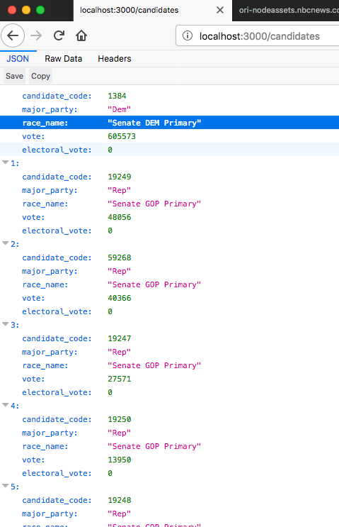

### This is a Node Express API 


I using an external json call to feed my examples

```
npm install
```

```
npm start
```

I used axios package because request and request-promise with Q didn't load the external 
feed.
router/index.js
```JS

var URL = 'http://ori-nodeassets.nbcnews.com/elections/2018-05-08/races_S_counties.json';

router.get('/races/:variable*?', function (req, res, next) {
    axios.get(URL).then(function (response) {  
      res.json(dal.apiRaces(req.params.variable, response.data));
    });

});
router.get('/candidates/:variable*?', function (req, res, next) {
    axios.get(URL).then(function (response) {
      res.json(dal.apiCandidates(req.params.variable, response.data));
    });
});
router.get('/counties/:variable*?', function (req, res, next) {
  axios.get(URL).then(function (response) {
    res.json(dal.apiCounties(req.params.variable, response.data));
  });
});
```
dataLayer.js example:

```JS

const apiRaces = (variable, body) => {
   var races = variable ? body.races.filter(x => x.race_name === variable) : body.races;
   return races.map( c => {
       return {
           race_id: c.race_id,
           election_date: c.election_date,
           party: c.party,
           state_name: c.state_name,
           total_vote: c.total_vote,
           percent_in: c.percent_in

       };
   });
};
const apiCandidates = (variable, body) => {
 var races = variable ? body.races.map(x => {
    if (x.candidates.filter(y => y.candidate_code == parseInt(variable))){
        return x;
    }


 }) : body.races;
 return races.reduce((acc, val) => acc.concat(val.candidates.filter(y => variable ? y.candidate_code == parseInt(variable) : y.candidate_code).map(c => {
            return {

                candidate_code: c.candidate_code,
                major_party: c.major_party,
                race_name: val.race_name,
                vote: c.vote,
                electoral_vote: c.electoral_vote
            };
 })), []);
};
const apiCounties = (variable, body) => {
    var races = variable ? body.races.map(x => {
        if (x.counties.filter(y => y.county_name === variable)){
            return x;
        }

       }) : body.races;

    console.log(races);
     return races.reduce((acc, val) => 
                acc.concat(val.counties.filter(x => variable ? x.county_name === variable : x.county_name).map(c =>
                    
                    
                    {
                    return {
                        county_code: c.county_code,
                        party_stratum_name: c.party_stratum_name,
                        registered: c.registered,
                        total_vote: c.total_vote,
                        fips_code: c.fips_code,
                        race_id: val.race_id
                    };
                })), []);

};
module.exports = {
    // export methods here
    apiRaces: apiRaces,
    apiCandidates: apiCandidates,
    apiCounties: apiCounties
};
```
api call screenshots: 




